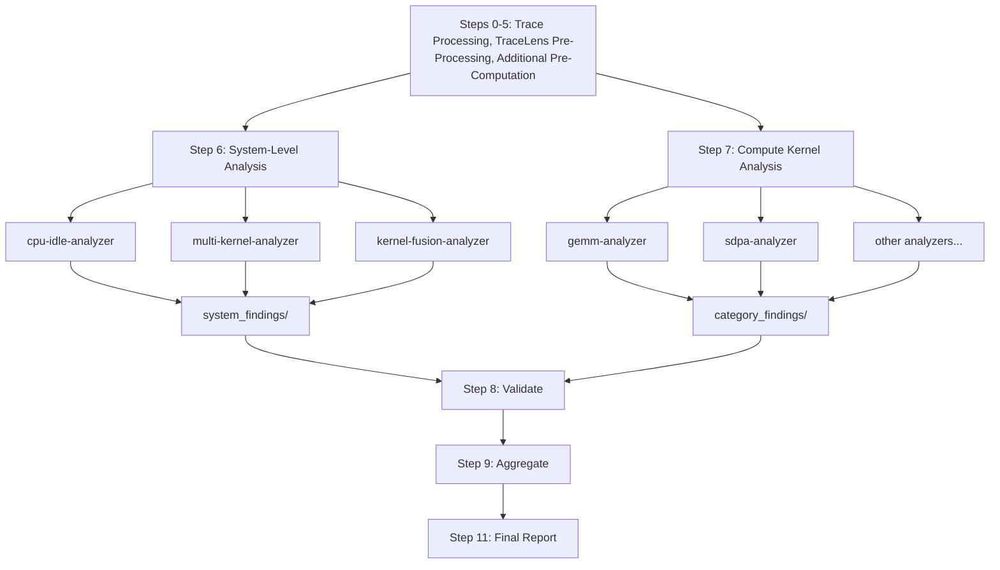

<!--
Copyright (c) 2026 Advanced Micro Devices, Inc. All rights reserved.

See LICENSE for license information.
-->

# TraceLens Agent: Trace Analysis

> **⚠️ Experimental**: This feature is under active development and may change.

The TraceLens Agentic Analysis module is an agentic performance analysis tool that uses TraceLens to analyze PyTorch profiler traces and generate actionable optimization recommendations. The system supports automated analysis of training and inference traces supported by TraceLens. Skills have been employed to define a structured workflow and interpret analysis results, combined with codified analysis to offer repeatability and reliability. The output is a single stakeholder-facing report (`analysis.md`) organized as a **prioritized bottleneck list**. Findings are ranked and grouped into three tiers (Compute Kernel Optimizations, Kernel Fusion Opportunities, and System-Level Optimizations), and each finding carries the supporting evidence , the reasoning behind the call-out and a possible concrete resolution.

---

## Prerequisites


### 1. Install TraceLens

**Local (no container):**

```bash
pip install git+https://github.com/AMD-AGI/TraceLens.git
```

**Cluster with container:**

SSH into your node, exec into the container, and install.

Option 1: pip install

```bash
ssh <node>
docker exec -it <container> bash
pip install git+https://github.com/AMD-AGI/TraceLens.git
```

Option 2: pip install from source

```bash
ssh <node>
docker exec -it <container> bash
git clone https://github.com/AMD-AGI/TraceLens.git
cd TraceLens
pip install -e .
```

### 2. Collect a trace

The orchestrator runs against a single PyTorch profiler trace (`.json` or `.json.gz`). Collection is workload-specific:

- **Training and eager inference traces**: Instrument your loop with `torch.profiler.profile(...)`, enabling CPU-side call-stack and shape capture (`with_stack=True`, `record_shapes=True`). Profile a representative steady-state window (a handful of training/inference steps, post-warmup) and dump the trace via `prof.export_chrome_trace(...)`. A single rank's trace is sufficient for per-rank analysis.
- **vLLM / SGLang inference traces**: Trace collection has framework-, version-, and execution-mode-specific requirements (custom Docker images or framework patches to add roofline annotations, profiler-config flags for graph-capture profiling, steady-state window selection, optional trace splitting). Follow the canonical guide in [Inference Analysis](../../../docs/Inference_analysis.md). For graph-mode workloads you will produce **two artifacts**: a graph-replay trace and a graph-capture folder; TraceLens (in inference mode with execution mode `graph replay + capture`) merges call-stack and shape information from the capture folder into the replay tree before analysis.

---

## Quick Start - How to Use

> **Note**: The instructions below use the Cursor IDE and CLI (`agent`), but the orchestrator skills are portable. They also work with Claude Code CLI (`claude`) and other agentic runners that support skill file discovery.

### To run via Cursor chat:

1. **In a Cursor chat with Claude Opus 4.7 High, invoke:**
   ```
   "Follow the analysis orchestrator installed with TraceLens and run the full agentic analysis workflow on <path_to_trace.json>"
   ```


2. **Provide if prompted:**
   - Trace file path
   - Platform
   - Analysis mode: default (training and non-vLLM/SGLang eager inference) vs inference (vLLM/SGLang)
   - If inference: execution mode (eager or graph replay + capture) and capture folder path if applicable
   - Node name / container name / venv name
   - Output directory (optional)


3. **Results:**
   - **User-facing output**: `analysis.md` is the only artifact intended for end-user review - a stakeholder report with prioritized recommendations organized into three sections: Compute Kernel Optimizations, Kernel Fusion Opportunities (experimental), and System-Level Optimizations. The Detailed Analysis section mirrors this order with detailed Compute Kernel Insights, Kernel Fusion Insights and System-Level Insights.
   - **Agent internals** (agent intermediates; review not recommended): `system_findings/`, `category_findings/`, `category_data/`, `metadata/`, `perf_report_csvs/`, `perf_report.xlsx`. See [Output Files](#output-files) for the full layout.

### To run via CLI (headless):

Use the Cursor `agent` CLI to run the orchestrator non-interactively. Specify your execution environment (local or cluster) in the prompt.

#### Install the Cursor CLI

The `agent` CLI is required for headless (non-interactive) runs:

```bash
curl https://cursor.com/install -fsS | bash
```

This installs the `agent` command. If you only plan to run analysis interactively through the Cursor IDE chat, you can skip this step. 


**Cluster + container — default (training and non-vLLM/SGLang eager inference):**

```bash
agent --model claude-opus-4-7-high --print --force --trust \
    "Follow the analysis orchestrator installed with the TraceLens pip package (look under TraceLens/Agent/Analysis/.cursor/skills/ in the package installation directory) and run the full agentic analysis workflow on <path_to_trace.json> with platform <platform>, analysis mode default, node <node>, container <container>, output to <output_dir>"
```

**Cluster + container — inference (vLLM/SGLang eager mode):**

```bash
agent --model claude-opus-4-7-high --print --force --trust \
    "Follow the analysis orchestrator installed with the TraceLens pip package (look under TraceLens/Agent/Analysis/.cursor/skills/ in the package installation directory) and run the full agentic analysis workflow on <path_to_trace.json> with platform <platform>, analysis mode inference, execution mode eager, node <node>, container <container>, output to <output_dir>"
```

**Cluster + container — inference (vLLM/SGLang graph replay + capture):**

```bash
agent --model claude-opus-4-7-high --print --force --trust \
    "Follow the analysis orchestrator installed with the TraceLens pip package (look under TraceLens/Agent/Analysis/.cursor/skills/ in the package installation directory) and run the full agentic analysis workflow on <path_to_trace.json> with platform <platform>, analysis mode inference, execution mode graph replay + capture, capture folder <path_to_capture_folder>, node <node>, container <container>, output to <output_dir>"
```

All parameters are passed inline so no interactive prompts are needed. This is useful for batch runs and CI pipelines (see `evals/generate_golden_refs.sh` for an example).

---

### Output Files

> **Only `analysis.md` is intended for end-user review.** Everything else under `analysis_output/` are agent internals: intermediates the orchestrator and sub-agents pass between steps.

```
analysis_output/
├── analysis.md                     # Stakeholder report (only user-facing output)
├── perf_report.xlsx                # Excel export of TraceLens perf report (Internal)
├── perf_report_csvs/               # CSV exports: gpu_timeline, ops_summary, ... (Internal)
├── category_data/                  # Per-category CSVs, metrics JSONs, tree data, fusion inputs (Internal)
│   ├── category_manifest.json          # Category metadata, GPU utilization, tier info
│   ├── multi_kernel_data.json          # Pre-computed memcpy/comm./overlap data
│   ├── fusion_candidates.json          # Kernel fusion candidate modules
│   ├── kernel_fusion_metrics.json      # Roofline savings estimates for fusion candidates
│   ├── <category>_ops.csv              # Filtered operations table for one compute-kernel category
│   ├── <category>_metrics.json         # Per-op metrics consumed by sub-agents
│   └── <category>_tree_data.json       # Pre-computed Trace2Tree slice for that category
├── system_findings/                # Sub-agent outputs: CPU/idle, multi-kernel, fusion (Internal)
│   ├── cpu_idle_findings.md            # CPU/idle (host-bound, GPU-idle) analysis output
│   ├── multi_kernel_findings.md        # Memcpy / collective-comm / overlap analysis output
│   └── kernel_fusion_findings.md       # Kernel fusion analysis output
├── category_findings/              # Sub-agent outputs: per compute-kernel category (Internal)
│   └── <category>_findings.md          # One file per compute-kernel category (gemm, sdpa, norm, ...)
└── metadata/                       # Category metadata + model_info.json (Internal)
    ├── <category>_metadata.json        # Platform specs, GPU utilization, config per category
    └── model_info.json                 # Model identification (model, architecture, scale, precision)
```

---

## Architecture

### Analysis Overview

The analysis is split into three independent tiers that can be composed separately:

- **System-Level Optimizations** (Step 6): Issues that affect the GPU pipeline as a whole -- idle time, memcpy overhead, NCCL blocking, compute/comm overlap. These are not about individual kernel efficiency.
- **Kernel Fusion Opportunities** (Steps 4b + 6, Experimental): Identifies multi-kernel modules that could be fused and estimates savings.
- **Compute Kernel Optimizations** (Step 7): Per-category kernel analysis (GEMM, SDPA, elementwise, etc.) focused on individual operation efficiency.

Each tier writes to a separate findings directory and produces an independently composable report section.



### Orchestrator

The **Analysis Orchestrator** skill coordinates the entire analysis workflow.
It queries user inputs, runs TraceLens to pre-compute trace data, and invokes system-level and compute kernel sub-agents in parallel. Finally, it validates outputs, aggregates findings, and generates a prioritized stakeholder report.

### Workflow Steps

```
0.   Query User Inputs (Platform, Trace Path, Analysis Mode, Environment Setup)
1.   Generate Performance Report (branches on analysis mode: training vs inference)
2-5. Prepare Category Data (GPU Util, Top Ops, Tree Data, Multi-Kernel Data, Category Filtering) + Fusion Candidate Extraction → category_data/fusion_candidates.json + kernel_fusion_metrics.json
5.5. Model Identification (subagent) → metadata/model_info.json
6.   System-Level Analysis (CPU/Idle + Multi-Kernel + Kernel Fusion, PARALLEL) → system_findings/
7.   Compute Kernel Subagents (PARALLEL) → category_findings/
8.   Validate Subagent Outputs (time sanity, efficiency anomalies, coverage)
9.   Aggregate Results: System-Level + Kernel Fusion + Compute Kernel Recommendations
10.  Generate Final Report (analysis.md)
```

### Sub-Agents

**System-Level (Step 6):**

| Agent | Purpose |
|-------|---------|
| `cpu-idle-analyzer` | Analyzes GPU idle time and CPU bottlenecks |
| `multi-kernel-analyzer` | Analyzes memcpy D2H/H2D patterns, NCCL blocking, compute/comm overlap |
| `kernel-fusion-analyzer` | Identifies multi-kernel fusion opportunities and estimates savings via roofline model |

**Compute Kernel (Step 7):**

| Agent | Purpose |
|-------|---------|
| `gemm-analyzer` | Analyzes matrix multiplication operations (mm, bmm, addmm) |
| `sdpa-analyzer` | Analyzes scaled dot-product attention (Flash, Paged) |
| `elementwise-analyzer` | Analyzes elementwise operations |
| `reduce-analyzer` | Analyzes reduction operations |
| `triton-analyzer` | Analyzes Triton-compiled kernels |
| `moe-analyzer` | Analyzes Mixture-of-Experts fused operations |
| `norm-analyzer` | Analyzes normalization operations (BatchNorm, LayerNorm, GroupNorm, etc.) |
| `convolution-analyzer` | Analyzes convolution operations |
| `generic-op-analyzer` | Analyzes uncategorized operations or operations without dedicated sub-agent |

### Sub-agent model

The orchestrator and all 13 sub-agents currently run on **`claude-opus-4-7-high`**, declared in each agent file's front matter under `.cursor/agents/`. The full set: `cpu-idle-analyzer`, `multi-kernel-analyzer`, `kernel-fusion-analyzer`, `model-identification-agent`, `gemm-analyzer`, `sdpa-analyzer`, `elementwise-analyzer`, `reduce-analyzer`, `triton-analyzer`, `moe-analyzer`, `norm-analyzer`, `convolution-analyzer`, `generic-op-analyzer`.

## Supported Analysis Modes

The orchestrator supports two analysis modes, selected during Step 0:

| Mode | Script | Use Case |
|------|--------|----------|
| **Default (training and non-vLLM/SGLang eager inference)** | `TraceLens_generate_perf_report_pytorch` | Training and non-vLLM/SGLang eager inference traces |
| **Inference (vLLM/SGLang)** | `TraceLens_generate_perf_report_pytorch_inference` | vLLM/SGLang traces in eager mode or graph replay + capture mode |

For inference mode, the orchestrator also asks for the execution mode:
- **Eager mode** — only the trace file is needed
- **Graph replay + capture** — requires a capture folder path; the script automatically classifies graph capture traces and merges call-stack/shape information into the graph replay tree

## Execution Environments

The orchestrator supports three execution environments. During Step 0, you are asked whether you are running locally or on a cluster, and the orchestrator builds the appropriate command prefixes automatically.

| Environment | When to use | What happens |
|-------------|-------------|--------------|
| **Local** | TraceLens is installed on the local machine | Commands run directly (no SSH, no Docker) |
| **Local + venv** | TraceLens is installed in a virtual environment on the local machine | Commands are prefixed with `source <venv>/bin/activate` |
| **Cluster (no container)** | TraceLens is installed natively on a remote node | Commands are wrapped with `ssh <node>` |
| **Cluster + venv** | TraceLens is installed in a venv on a remote node | Commands are wrapped with `ssh <node> "source <venv>/bin/activate && ..."` |
| **Cluster + container** | TraceLens is installed inside a Docker container on a remote node | Commands are wrapped with `ssh <node> "docker exec <container> ..."` 

## Integrating with Model Optimization Flows

`analysis.md` is designed to be consumed by both readers and optimization systems to iteratively resolve bottlenecks (kernel tuning, fusion, batching, precision narrowing, etc.).

### Anatomy of `analysis.md`

Every report has the same top-level structure, in this order:

1. **Executive Summary**: Narrative one-paragraph workload characterization, a metrics table (Total Time, Compute %, Idle %, Exposed Communication %, Top Bottleneck Category), and an embedded performance-improvement chart.
2. **Compute Kernel Optimizations**: Top Operations table followed by per-category P-items (P1, P2, …) sorted by `impact_score`. Each P-item has an summarizing Insight / Action / Impact triplet.
3. **Kernel Fusion Opportunities (Experimental)**: Kernel fusion candidates 
4. **System-Level Optimizations (Experimental)**: System-level P-items (idle, memcpy, compute/comm overlap)
5. **Detailed Analysis**: Per-P-item drill-down (`Compute Kernel Insights`, `Kernel Fusion Insights`, `System-Level Insights`) with identification rationale, data tables, and reasoning.

### Reference snippets

The snippets below are illustrative excerpts showing the format of the agent's analysis report.

*Note: All performance data shown here are example outputs from TraceLens, intended to illustrate the agent's capabilities. They are not official performance benchmarks.*

> <a id="detailed-analysis-compute-p1"></a>
> <!-- reasoning-candidate tier=compute rank=1 -->
> #### 🔴 P1: Compute-bound BF16 GEMMs underrunning roofline (Tensile)
>
> **Identification:** 18 BF16 `aten::mm` shapes were flagged as the dominant GEMM cluster in the trace, accounting for 45.7 s of GPU kernel time (~80.6% of compute time). All flagged operations dispatch through the **Tensile** backend with `bound_type = compute`. The cluster spans the large MLP shapes (M=24576, K=8192, N=28672), the gate/up shapes (N=10240), the QKV/output shapes (N=8192), and the LM-head shapes (N=128256). (source: `gemm_metrics.json` → `category_findings[0].members[]`, `operations[].library`, `operations[].efficiency.bound_type`)
>
> **Data:**
>
> | Operation | Args | Time (ms) | %E2E | Count | FLOPS/Byte | Efficiency | Bound |
> |-----------|------|-----------|------|-------|------------|------------|-------|
> | aten::mm | (24576,8192) × (8192,28672) bf16 | 7607.463 | 13.42 | 320 | 5059.76 | 68.74% of 708 TFLOPS | compute-bound |
> | aten::mm | (24576,8192) × (8192,28672) bf16 | 6636.191 | 11.70 | 320 | 5059.76 | 79.04% of 708 TFLOPS | compute-bound |
> | aten::mm | (28672,24576) × (24576,8192) bf16 | 6313.337 | 11.13 | 320 | 5059.76 | 82.70% of 708 TFLOPS | compute-bound |
> | aten::mm | (24576,28672) × (28672,8192) bf16 | 6071.557 | 10.71 | 320 | 5059.76 | 85.99% of 708 TFLOPS | compute-bound |
>
> **Reasoning for Slowdown:** Every flagged shape has very high arithmetic intensity (FLOPS/Byte 3510–5863), so each GEMM is correctly compute-bound against the BF16 matrix-FP roofline (708 TFLOPS) rather than HBM-bound. The achieved TFLOPS/s sit between 486.7 and 613.5, which is 68.7%–86.7% of peak — the heaviest shape (`(24576,8192) × (8192,28672)`, 7.6 s of kernel time, count = 320) lands at only 68.7%, and a second 6.6 s instance of the same shape only reaches 79.0%, indicating the same logical GEMM is hitting more than one Tensile kernel and at least one is sub-optimal.
>
> **Resolution:** Tile / wave-occupancy tuning targets the specific Tensile kernels selected for these shapes so the same FLOPs are issued under a better-utilized MFMA pipeline, raising achieved TFLOPS/s without changing the algorithm. Narrowing precision (BF16 → FP8/FP4 where the model tolerates it) doubles or quadruples the matrix roofline (708 → 1273 TFLOPS at FP8, higher at FP4), directly lowering the compute floor for these compute-bound shapes. Generate reproducers for the kernel team for the lowest-efficiency shapes (68.7%, 69.7%, 74.0%) so the Tensile selector can be revisited for those tile/M-N-K combinations.
>
> **Impact estimate:**
> <!-- impact-begin kind=detail_estimate low=12.97 high=17.27 -->
> - Low end impact_score: 12.97
> - High end impact_score: 17.27
> <!-- impact-end -->

> <a id="detailed-analysis-fusion-P1"></a>
> <!-- reasoning-candidate tier=system rank=1 -->
> #### 🔴 P1: Unfused RMSNorm (4.789 ms, 49 instances)
>
> **Identification:** The `Qwen2RMSNorm` module launches 8 distinct GPU kernels per call across 49 trace instances and contains no fused-kernel marker, so every step of the rsqrt/mean/mul normalization is a separate HBM-bound launch (source: `fusion_candidates.json` → `module_name`, `has_fused_kernel`, `kernels[]`).
>
> **Data:**
>
> | Kernel | Type | Duration (us) | Perf model |
> |--------|------|---------------|------------|
> | `direct_copy_kernel_cuda` (float) | Elementwise | 22.09 | Yes |
> | `pow_tensor_scalar_kernel_impl` (float, x²) | Elementwise | 17.92 | Yes |
> | `reduce_kernel ... MeanOps<float>` | Reduction | 8.02 | Yes |
> | `CUDAFunctorOnSelf_add` (float, +epsilon) | Elementwise | 1.60 | Yes |
> | `rsqrt_kernel_cuda` (float) | Elementwise | 1.72 | Yes |
> | `BinaryFunctor MulFunctor` (float×float) | Elementwise | 18.44 | Yes |
> | `bfloat16_copy_kernel_cuda` | Elementwise | 14.91 | Yes |
> | `BinaryFunctor MulFunctor` (bf16×bf16) | Elementwise | 13.03 | Yes |
>
> **Impact estimate:**
>
> <!-- impact-begin kind=detail_estimate low=10.04 high=13.39 -->
> - Low end impact_score: 10.04
> - High end impact_score: 13.39
> <!-- impact-end -->
> - Coverage: 8 of 8 kernels modelled
> - Fusion pattern: memory-bound, memory_bound
> - Confidence: High — module name and kernel composition both match the canonical RMSNorm decomposition.


### Programmatic Interface

Every report embeds HTML comment markers that a system can leverage without parsing prose:

- `<!-- impact-begin kind=p_item category=<cat> low=<x> mid=<y> high=<z> -->` … `<!-- impact-end -->` wraps every P-item's Impact line. `mid` is the canonical `impact_score`. `<cat>` is the analyzer category (`gemm`, `sdpa_fwd`, `elementwise`, `norm_fwd`, etc.).
- `<!-- impact-begin kind=top_ops -->` … `<!-- impact-end -->` wraps the Top Operations table at the start of the Compute Kernel Optimizations section.
- Per-P-item anchors `#detailed-analysis-compute-pN`, `#detailed-analysis-fusion-PN`, and `#detailed-analysis-system-pN` link each summary card to its detailed reasoning section.

### Potential Consumption Loop

1. Run the orchestrator on a baseline trace (see [Quick Start](#quick-start---how-to-use)).
2. Study `analysis.md`, focusing on the `## Detailed Analysis` section. Within each tier subsection (`### Compute Kernel Insights`, `### Kernel Fusion Insights`, `### System-Level Insights`), follow the per-P-item anchors (`detailed-analysis-compute-pN`, `detailed-analysis-fusion-PN`, `detailed-analysis-system-pN`) and extract each P-item's Identification, Data, Reasoning, Resolution, and `impact-begin kind=detail_estimate` low/high bounds. The detailed cards carry the evidence and guidance an optimization agent needs to act on.
3. Use the prioritization (P-item ordering, `impact_score`) to drive your model optimization workflow.
