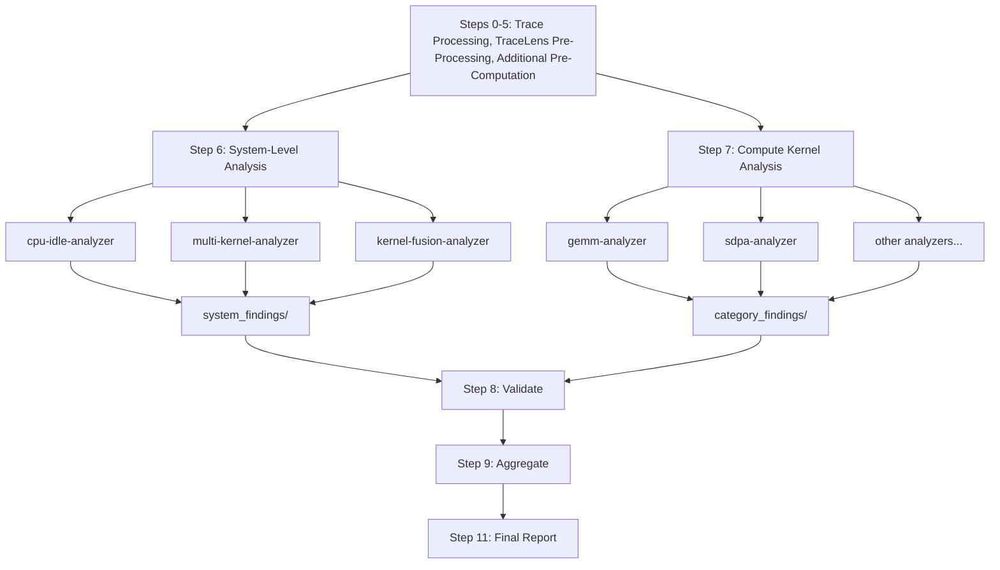

<!--
Copyright (c) 2026 Advanced Micro Devices, Inc. All rights reserved.

See LICENSE for license information.
-->

# TraceLens Agent: Trace Analysis

> **⚠️ Experimental**: This feature is under active development and may change.

The TraceLens Agentic Analysis module is an agentic performance analysis tool that uses TraceLens to analyze PyTorch profiler traces and generate actionable optimization recommendations. The system supports automated analysis of training and inference traces supported by TraceLens. Skills have been employed to define a structured workflow and interpret analysis results, combined with codified analysis to offer repeatability and reliability.

---

## Prerequisites


### 1. Install TraceLens

**Local (no container):**

```bash
pip install git+https://github.com/AMD-AGI/TraceLens-internal.git
```

**Cluster with container:**

SSH into your node, exec into the container, and install.

Option 1: pip install

```bash
ssh <node>
docker exec -it <container> bash
pip install git+https://github.com/AMD-AGI/TraceLens-internal.git
```

Option 2: pip install from source

```bash
ssh <node>
docker exec -it <container> bash
git clone https://github.com/AMD-AGI/TraceLens-internal.git
cd TraceLens-internal
pip install -e .
```

---

## Quick Start - How to Use

> **Note**: The instructions below use the Cursor IDE and CLI (`agent`), but the orchestrator skills are portable. They also work with Claude Code CLI (`claude`) and other agentic runners that support skill file discovery.

### To run via Cursor chat:

1. **In a Cursor chat with Claude Opus 4.7 High, invoke:**
   ```
   "Follow the Analysis Orchestrator installed with TraceLens and run the full agentic analysis workflow on <path_to_trace.json>"
   ```


2. **Provide if prompted:**
   - Trace file path
   - Platform
   - Analysis mode: default (training and non-VLLM/SGLang eager inference) vs inference (vLLM/SGLang)
   - If inference: execution mode (eager or graph replay + capture) and capture folder path if applicable
   - Node name / container name / venv name
   - Output directory (optional)


3. **Results:**
   - **Primary output**: `analysis.md` - Stakeholder report with prioritized recommendations organized into three sections: Compute Kernel Optimizations, Kernel Fusion Opportunities (experimental), and System-Level Optimizations. The Detailed Analysis section mirrors this order with Compute Kernel Insights, Kernel Fusion Insights and System-Level Insights.
   - **Intermidate outputs** (Review not recommended):
     - `system_findings/` - System-level and kernel fusion analysis intermediates
     - `category_findings/` - Per-category compute kernel analysis intermediates

### To run via CLI (headless):

Use the Cursor `agent` CLI to run the orchestrator non-interactively. Specify your execution environment (local or cluster) in the prompt.

#### Install the Cursor CLI

The `agent` CLI is required for headless (non-interactive) runs:

```bash
curl https://cursor.com/install -fsS | bash
```

This installs the `agent` command. If you only plan to run analysis interactively through the Cursor IDE chat, you can skip this step. 


**Cluster + container — default (training and non-vLLM/SGLang eager inference):**

```bash
agent --model claude-opus-4-7-high --print --force --trust \
    "Follow the Analysis Orchestrator installed with TraceLens and run the full agentic analysis workflow on <path_to_trace.json> with platform <platform>, analysis mode default, node <node>, container <container>, output to <output_dir>"
```

**Cluster + container — inference (vLLM/SGLang eager mode):**

```bash
agent --model claude-opus-4-7-high --print --force --trust \
    "Follow the Analysis Orchestrator installed with TraceLens and run the full agentic analysis workflow on <path_to_trace.json> with platform <platform>, analysis mode inference, execution mode eager, node <node>, container <container>, output to <output_dir>"
```

**Cluster + container — inference (vLLM/SGLang graph replay + capture):**

```bash
agent --model claude-opus-4-7-high --print --force --trust \
    "Follow the Analysis Orchestrator installed with TraceLens and run the full agentic analysis workflow on <path_to_trace.json> with platform <platform>, analysis mode inference, execution mode graph replay + capture, capture folder <path_to_capture_folder>, node <node>, container <container>, output to <output_dir>"
```

All parameters are passed inline so no interactive prompts are needed. This is useful for batch runs and CI pipelines (see `evals/generate_golden_refs.sh` for an example).

---

### Output Files

```
analysis_output/
├── analysis.md                     # Stakeholder report
├── perf_report.xlsx                # Excel performance report
├── perf_report_csvs/               # CSV exports (gpu_timeline, ops_summary, etc.)
├── category_data/                  # Per-category CSVs, metrics JSONs, tree data
│   ├── category_manifest.json      # Category metadata, GPU utilization, tier info
│   ├── multi_kernel_data.json      # Pre-computed memcpy/NCCL/overlap data
│   ├── fusion_candidates.json      # Kernel fusion candidate modules
│   ├── kernel_fusion_metrics.json  # Roofline savings estimates for fusion candidates
│   ├── *_ops.csv
│   ├── *_metrics.json
│   └── *_tree_data.json
├── system_findings/                # System-level analysis (CPU/idle, multi-kernel, fusion)
│   ├── *_findings.md
│   └── kernel_fusion_findings.md   # Kernel fusion analysis output
├── category_findings/              # Compute kernel analysis (markdown)
│   └── *_findings.md
└── metadata/                       # Category metadata JSONs
    └── *_metadata.json
```

---

## Architecture

### Analysis Overview

The analysis is split into three independent tiers that can be composed separately:

- **System-Level Optimizations** (Step 6): Issues that affect the GPU pipeline as a whole -- idle time, memcpy overhead, NCCL blocking, compute/comm overlap. These are not about individual kernel efficiency.
- **Kernel Fusion Opportunities** (Steps 4b + 6, Experimental): Identifies multi-kernel modules that could be fused and estimates savings.
- **Compute Kernel Optimizations** (Step 7): Per-category kernel analysis (GEMM, SDPA, elementwise, etc.) focused on individual operation efficiency.

Each tier writes to a separate findings directory and produces an independently composable report section.



### Orchestrator

The **Analysis Orchestrator** skill coordinates the entire analysis workflow.
It queries user inputs, runs TraceLens to pre-compute trace data, and invokes system-level and compute kernel sub-agents in parallel. Finally, it validates outputs, aggregates findings, and generates a prioritized stakeholder report.

### Workflow Steps

```
0.   Query User Inputs (Platform, Trace Path, Analysis Mode, Environment Setup)
1.   Generate Performance Report (branches on analysis mode: training vs inference)
2-5. Prepare Category Data (GPU Util, Top Ops, Tree Data, Multi-Kernel Data, Category Filtering) + Fusion Candidate Extraction → category_data/fusion_candidates.json + kernel_fusion_metrics.json
5.5. Model Identification (subagent) → metadata/model_info.json
6.   System-Level Analysis (CPU/Idle + Multi-Kernel + Kernel Fusion, PARALLEL) → system_findings/
7.   Compute Kernel Subagents (PARALLEL) → category_findings/
8.   Validate Subagent Outputs (time sanity, efficiency anomalies, coverage)
9.   Aggregate Results: System-Level + Kernel Fusion + Compute Kernel Recommendations
10.  Generate Final Report (analysis.md)
```

### Sub-Agents

**System-Level (Step 6):**

| Agent | Purpose |
|-------|---------|
| `cpu-idle-analyzer` | Analyzes GPU idle time and CPU bottlenecks |
| `multi-kernel-analyzer` | Analyzes memcpy D2H/H2D patterns, NCCL blocking, compute/comm overlap |
| `kernel-fusion-analyzer` | Identifies multi-kernel fusion opportunities and estimates savings via roofline model |

**Compute Kernel (Step 7):**

| Agent | Purpose |
|-------|---------|
| `gemm-analyzer` | Analyzes matrix multiplication operations (mm, bmm, addmm) |
| `sdpa-analyzer` | Analyzes scaled dot-product attention (Flash, Paged) |
| `elementwise-analyzer` | Analyzes elementwise operations |
| `reduce-analyzer` | Analyzes reduction operations |
| `triton-analyzer` | Analyzes Triton-compiled kernels |
| `moe-analyzer` | Analyzes Mixture-of-Experts fused operations |
| `norm-analyzer` | Analyzes normalization operations (BatchNorm, LayerNorm, GroupNorm, etc.) |
| `convolution-analyzer` | Analyzes convolution operations |
| `generic-op-analyzer` | Analyzes uncategorized operations or operations without dedicated sub-agent |

### Sub-agent model tiers

The orchestrator dispatches per-category analysis to sub-agents whose model tier is declared in each agent file's front matter:

- **`claude-opus-4-7-high`**: Orchestrator + 3 judgment-heavy sub-agents: `kernel-fusion-analyzer`, `generic-op-analyzer`, `model-identification-agent`.
- **`claude-4.6-sonnet-medium-thinking`**: 10 templated / light-reasoning sub-agents: `cpu-idle-analyzer`, `gemm-analyzer`, `sdpa-analyzer`, `norm-analyzer`, `elementwise-analyzer`, `reduce-analyzer`, `convolution-analyzer`, `triton-analyzer`, `moe-analyzer`, `multi-kernel-analyzer`.

## Supported Analysis Modes

The orchestrator supports two analysis modes, selected during Step 0:

| Mode | Script | Use Case |
|------|--------|----------|
| **Default (training and non-vLLM/SGLang eager inference)** | `TraceLens_generate_perf_report_pytorch` | Training and non-vLLM/SGLang eager inference traces |
| **Inference (vLLM/SGLang)** | `TraceLens_generate_perf_report_pytorch_inference` | vLLM/SGLang traces in eager mode or graph replay + capture mode |

For inference mode, the orchestrator also asks for the execution mode:
- **Eager mode** — only the trace file is needed
- **Graph replay + capture** — requires a capture folder path; the script automatically classifies graph capture traces and merges call-stack/shape information into the graph replay tree

## Execution Environments

The orchestrator supports three execution environments. During Step 0, you are asked whether you are running locally or on a cluster, and the orchestrator builds the appropriate command prefixes automatically.

| Environment | When to use | What happens |
|-------------|-------------|--------------|
| **Local** | TraceLens is installed on the local machine | Commands run directly (no SSH, no Docker) |
| **Local + venv** | TraceLens is installed in a virtual environment on the local machine | Commands are prefixed with `source <venv>/bin/activate` |
| **Cluster (no container)** | TraceLens is installed natively on a remote node | Commands are wrapped with `ssh <node>` |
| **Cluster + venv** | TraceLens is installed in a venv on a remote node | Commands are wrapped with `ssh <node> "source <venv>/bin/activate && ..."` |
| **Cluster + container** | TraceLens is installed inside a Docker container on a remote node | Commands are wrapped with `ssh <node> "docker exec <container> ..."` 

## Bug Reporting

Please include the following details when reporting an issue. Please use the TraceLens-internal private repo to share sensitive data.

- Description
- Software Version
- Hardware (e.g., GPU model)
- Issue Observed
- Expected Behavior
- Scripts/Commands Used
- Error/Unexpected Behavior
- Trace Files Used for Analysis