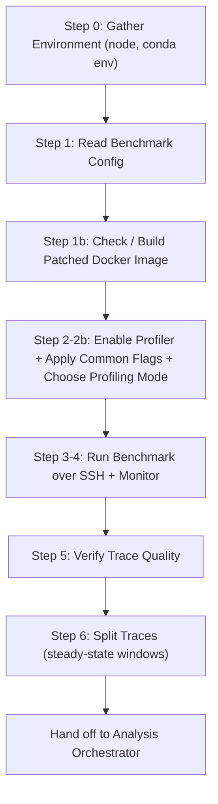

<!--
Copyright (c) 2026 Advanced Micro Devices, Inc. All rights reserved.

See LICENSE for license information.
-->

# TraceLens Agent: Magpie Benchmark + Profiling

> **⚠️ Experimental**: This feature is under active development and may change.

The TraceLens Agentic Profiling module drives LLM inference benchmarking and PyTorch profiler trace collection using the [Magpie](https://github.com/AMD-AGI/Magpie) framework. A skill coordinates environment setup, Docker image patching, profiler-window tuning, benchmark execution, trace verification, and trace splitting — producing traces that are ready for the [TraceLens Analysis Orchestrator](../Analysis/README.md). Supports vLLM and SGLang, in eager or graph-replay + capture mode.

---

## Prerequisites

### 1. Install TraceLens

Installing TraceLens makes the skill discoverable to the agentic runner.

**Local (no container):**

```bash
pip install git+https://github.com/AMD-AGI/TraceLens.git
```

**Cluster with container:**

```bash
ssh <node>
docker exec -it <container> bash
pip install git+https://github.com/AMD-AGI/TraceLens.git
```

### 2. Set up the benchmark host

- SSH access to a GPU node with Docker and AMD/NVIDIA GPUs
- A conda environment with [Magpie](https://github.com/AMD-AGI/Magpie) installed
- HuggingFace weights cached locally or an `HF_TOKEN` for gated models
- A Magpie benchmark YAML config (typically under `Magpie/examples/`)

---

## Quick Start - How to Use

> **Note**: The instructions below use the Cursor IDE and CLI (`agent`), but the skill is portable. It also works with Claude Code CLI (`claude`) and other agentic runners that support skill file discovery.

### To run via Cursor chat:

1. **In a Cursor chat with Claude Opus 4.7 High, invoke:**
   ```
   "Follow the Magpie Benchmark + Profiling skill installed with TraceLens and run the benchmark + trace collection workflow on <path_to_config.yaml>"
   ```

2. **Provide if prompted:**
   - Target node, conda env name, conda install path
   - Whether the Docker image is already patched, or a vLLM version tag / SGLang GPU type to build a patched image
   - Profiling mode: targeted steady-state window (recommended) vs full benchmark

3. **Results:**
   - **Primary output**: per-rank PyTorch profiler traces in `results/benchmark_{framework}_{timestamp}/torch_trace/`, ready for the [Analysis Orchestrator](../Analysis/README.md).
   - **Trace splits** (after Step 6): `torch_trace/trace_split/` with `mixed_steady_state_*.json.gz` (recommended), `prefilldecode_steady_state_*.json.gz`, `decode_only_steady_state_*.json.gz`, and `execution_details.json` / `.csv`.
   - **Benchmark artifacts**: `benchmark_report.json`, `summary.txt`, `config.yaml`, container/server logs.

### To run via CLI (headless):

Use the Cursor `agent` CLI to run the skill non-interactively. Install with:

```bash
curl https://cursor.com/install -fsS | bash
```

Then pass all parameters inline so no prompts are needed:

```bash
agent --model claude-opus-4-7-high --print --force --trust \
    "Follow the Magpie Benchmark + Profiling skill installed with TraceLens and run the benchmark + trace collection workflow on <path_to_config.yaml>, node <node>, conda env <env>, Docker image patched <yes|no, vllm_version=vXX or sglang gpu_type=<gpu_type> if no>, profiling mode <targeted|full>, output to <workspace_dir>"
```

If you only plan to run profiling interactively through the Cursor IDE chat, you can skip installing the CLI.

---

### Output Files

```
results/benchmark_{framework}_{timestamp}/
├── benchmark_report.json           # Parsed benchmark metrics
├── summary.txt                     # Human-readable summary
├── config.yaml                     # Snapshot of run configuration
├── benchmark_stdout.log            # Container stdout
├── benchmark_stderr.log            # Container stderr
├── server.log                      # Inference server log
└── torch_trace/                    # PyTorch profiler traces
    ├── *-TP-{N}-{DECODE,EXTEND}.trace.json.gz   # SGLang per-rank traces
    ├── merged-*.trace.json.gz                   # SGLang merged trace
    ├── *-rank-{N}.*.pt.trace.json.gz            # vLLM per-rank traces
    ├── *async_llm.*.pt.trace.json.gz            # vLLM CPU-side AsyncLLM trace
    ├── capture_traces/                          # Graph-capture traces (graph mode)
    └── trace_split/                             # Step 6 output (ready for analysis)
```

---

## Architecture

### Workflow Overview

The skill walks through a fixed sequence of steps that prepare the host, run the benchmark, and split traces into analysis-ready windows.



### Orchestrator

The **Magpie Benchmark + Profiling** skill coordinates the entire trace-collection workflow. It optionally builds a patched Docker image, mutates the benchmark YAML and Magpie scripts (`benchmark_lib.sh`, `benchmark_serving.py`) to enable profiling, runs the benchmark on a remote node, verifies that the traces contain GPU kernels, and splits the rank-0 trace into steady-state windows ready for `TraceLens_generate_perf_report_pytorch_inference`.

### Supported Frameworks

| Framework | Build Script (patched image) | Targeted-Window Mechanism |
|-----------|------------------------------|---------------------------|
| **vLLM** (`framework: vllm`) | `examples/custom_workflows/inference_analysis/build_docker_vllm.sh <version_tag>` | `EXTRA_VLLM_ARGS` profiler-config flags + `benchmark_lib.sh` `num_prompts` patch |
| **SGLang** (`framework: sglang`) | `examples/custom_workflows/inference_analysis/build_docker_sglang_v059.sh <gpu_type>` | `benchmark_serving.py` `start_step`/`num_steps` patch + `benchmark_lib.sh` `num_prompts` patch |

The skill parses the `case` blocks of these scripts at runtime to discover currently supported tags.

### Profiling Modes

| Mode | When to use | What happens |
|------|-------------|--------------|
| **Targeted steady-state window** | Recommended; smaller, focused traces of steady-state decode | Computes `delay_iters` / `max_iters` from `OSL`, `CONC`, `RANDOM_RANGE_RATIO`; framework-specific edits applied; `num_prompts` multiplier raised so the window is reached |
| **Full benchmark** | When you need the entire run (warmup + steady state + ramp-down) | No targeted-window edits; common profiler flags still required; traces can be several GB per rank |

### Execution Environments

| Environment | What happens |
|-------------|--------------|
| **Cluster + container** (default) | Commands wrapped with `ssh <node>`; Magpie launches a `--rm` container and bind-mounts the workspace at `/workspace` |
| **Local** (`--run-mode local`) | Commands run directly; profiler-config paths use the host trace directory |

## Trace Splitting and Handoff to Analysis

Step 6 produces split traces in `torch_trace/trace_split/` via `TraceLens.TraceUtils.split_inference_trace_annotation`. The skill then prints (but does **not** run) a `generate_perf_report_pytorch_inference.py` command that the user can launch to feed the split traces into the [Analysis Orchestrator](../Analysis/README.md). See [`docs/Inference_analysis.md`](../../../docs/Inference_analysis.md) for splitting heuristics and prefill/decode mix selection.

## Bug Reporting

Please include the following details when reporting an issue. Please use direct or internal channels to share sensitive data.

- Description
- Software Version (TraceLens, Magpie, vLLM/SGLang, Docker image tag)
- Hardware (GPU model, GPU count / TP)
- Benchmark YAML Config Used
- Profiling Mode (targeted vs full; computed `delay_iters` / `max_iters` if applicable)
- Issue Observed / Expected Behavior
- Scripts/Commands Used
- Error/Unexpected Behavior
- Trace Files Collected (sizes, naming, event category counts from Step 5)
