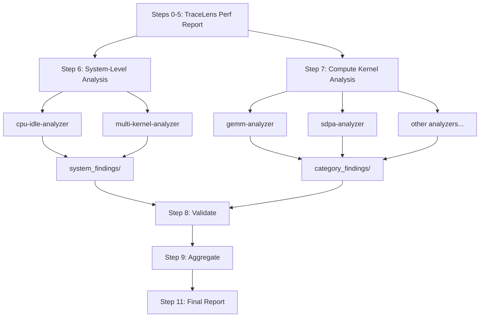

<!--
Copyright (c) 2024 - 2025 Advanced Micro Devices, Inc. All rights reserved.

See LICENSE for license information.
-->

# TraceLens Agentic Mode: Standalone Trace Analysis

> **⚠️ Experimental**: This feature is under active development and may change.

TraceLens Agentic Mode for Standalone Analysis is a Cursor-based AI-powered performance analysis tool that uses TraceLens to analyze PyTorch profiler traces and generate actionable optimization recommendations. The system supports automated analysis of training and inference traces supported by TraceLens. LLMs have been employed to define a structured workflow and interpret analysis results, combined with codified analysis to offer repeatability and reliability.

---

## Prerequisites

### 1. Clone TraceLens-internal

```bash
git clone https://github.com/AMD-AGI/TraceLens-internal.git
cd TraceLens-internal
```

### 2. Install TraceLens

**Local (no container):**

```bash
pip install -e .
```

**Cluster with container:**

SSH into your node, exec into the container, and install:

```bash
ssh <node>
docker exec -it <container> bash
cd /path/to/TraceLens-internal
pip install -e .
```

### 3. Install the Cursor CLI (Optional)

The `agent` CLI is required for headless (non-interactive) runs:

```bash
curl https://cursor.com/install -fsS | bash
```

This installs the `agent` command. If you only plan to run analysis interactively through the Cursor IDE chat, you can skip this step.

---

## Quick Start - How to Use


### To run via Cursor chat:

1. **In a Cursor (v2.5+) chat with Claude-4.6-Opus-High, invoke:**
   ```
   Run standalone analysis on <path_to_trace.json>
   ```


2. **Provide when prompted:**
   - Trace file path
   - Platform (MI300X/MI325X/MI350X/MI355X/MI400)
   - Analysis mode: default (training and non-VLLM/SGLang eager inference) vs inference (vLLM/SGLang)
   - If inference: execution mode (eager or graph replay + capture) and capture folder path if applicable
   - Node name / container name / venv name
   - Output directory (optional)

### To run via CLI (headless):

Use the Cursor `agent` CLI to run the orchestrator non-interactively. Specify your execution environment (local or cluster) in the prompt.

**Cluster + container — default (training and eager inference non-vLLM/SGLang):**

```bash
cd TraceLens/AgenticMode/Standalone
agent --print --force --trust \
    "Run standalone analysis on <path_to_trace.json> with platform <platform>, analysis mode default, node <node>, container <container>, output to <output_dir>"
```

**Cluster + container — inference (vLLM/SGLang eager mode):**

```bash
cd TraceLens/AgenticMode/Standalone
agent --print --force --trust \
    "Run standalone analysis on <path_to_trace.json> with platform <platform>, analysis mode inference, execution mode eager, node <node>, container <container>, output to <output_dir>"
```

**Cluster + container — inference (vLLM/SGLang graph replay + capture):**

```bash
cd TraceLens/AgenticMode/Standalone
agent --print --force --trust \
    "Run standalone analysis on <path_to_trace.json> with platform <platform>, analysis mode inference, execution mode graph replay + capture, capture folder <path_to_capture_folder>, node <node>, container <container>, output to <output_dir>"
```

All parameters are passed inline so no interactive prompts are needed. This is useful for batch runs and CI pipelines (see `evals/generate_golden_refs.sh` for an example).

3. **Get results:**
   - **Primary output**: `standalone_analysis.md` - Stakeholder report with prioritized recommendations
   - **Additional outputs:**
     - `system_findings/` - System-level analysis
     - `category_findings/` - Per-category compute kernel analysis

---

### Output Files

```
analysis_output/
├── standalone_analysis.md          # Stakeholder report
├── perf_report.xlsx                # Excel performance report
├── perf_report_csvs/               # CSV exports (gpu_timeline, ops_summary, etc.)
├── category_data/                  # Per-category CSVs, metrics JSONs, tree data
│   ├── category_manifest.json      # Category metadata, GPU utilization, tier info
│   ├── multi_kernel_data.json      # Pre-computed memcpy/NCCL/overlap data
│   ├── *_ops.csv
│   ├── *_metrics.json
│   └── *_tree_data.json
├── system_findings/                # System-level analysis (CPU/idle, multi-kernel)
│   └── *_findings.md
├── category_findings/              # Compute kernel analysis (markdown)
│   └── *_findings.md
└── metadata/                       # Category metadata JSONs
    └── *_metadata.json
```

---

## Architecture

### Two-Tier Analysis Overview

The analysis is split into two independent tiers that can be composed separately:

- **System-Level Optimizations** (Step 6): Issues that affect the GPU pipeline as a whole -- idle time, memcpy overhead, NCCL blocking, compute/comm overlap. These are not about individual kernel efficiency.
- **Compute Kernel Optimizations** (Step 7): Per-category kernel analysis (GEMM, SDPA, elementwise, etc.) focused on individual operation efficiency.

Each tier writes to a separate findings directory and produces an independently composable report section.



### Orchestrator

The **Standalone Analysis Orchestrator** skill coordinates the entire analysis workflow.
It queries user inputs, runs TraceLens to pre-compute trace data, and invokes system-level and compute kernel sub-agents in parallel. Finally, it validates outputs, aggregates findings, and generates a prioritized stakeholder report.

### Workflow Steps

```
0.   Query User Inputs (Platform, Trace Path, Analysis Mode, Environment Setup)
1.   Generate Performance Report (branches on analysis mode: training vs inference)
2-5. Prepare Category Data (GPU Util, Top Ops, Tree Data, Multi-Kernel Data, Category Filtering)
5.5. Model Identification (subagent) → metadata/model_info.json
6.   System-Level Analysis (CPU/Idle + Multi-Kernel, PARALLEL) → system_findings/
7.   Compute Kernel Subagents (PARALLEL) → category_findings/
8.   Validate Subagent Outputs (time sanity, efficiency anomalies, coverage)
9.   Aggregate Results: System-Level + Compute Kernel Recommendations
10.  Generate Final Report (standalone_analysis.md)
```

### Sub-Agents

**System-Level (Step 6):**

| Agent | Purpose |
|-------|---------|
| `cpu-idle-analyzer` | Analyzes GPU idle time and CPU bottlenecks |
| `multi-kernel-analyzer` | Analyzes memcpy D2H/H2D patterns, NCCL blocking, compute/comm overlap |

**Compute Kernel (Step 7):**

| Agent | Purpose |
|-------|---------|
| `gemm-analyzer` | Analyzes matrix multiplication operations (mm, bmm, addmm) |
| `sdpa-analyzer` | Analyzes scaled dot-product attention (Flash, Paged) |
| `elementwise-analyzer` | Analyzes elementwise operations (add, mul, copy, etc.) |
| `reduce-analyzer` | Analyzes reduction operations (mean, sum, softmax) |
| `triton-analyzer` | Analyzes Triton-compiled kernels |
| `moe-analyzer` | Analyzes Mixture-of-Experts fused operations |
| `norm-analyzer` | Analyzes normalization operations (BatchNorm, LayerNorm, GroupNorm, etc.) |
| `convolution-analyzer` | Analyzes convolution operations |
| `generic-op-analyzer` | Analyzes uncategorized operations (communication, graph, misc.) |


## Supported Analysis Modes

The orchestrator supports two analysis modes, selected during Step 0:

| Mode | Script | Use Case |
|------|--------|----------|
| **Default (training and eager inference)** | `TraceLens_generate_perf_report_pytorch` | Training traces, eager inference traces |
| **Inference (vLLM/SGLang)** | `TraceLens_generate_perf_report_pytorch_inference` | vLLM/SGLang traces in eager mode or graph replay + capture mode |

For inference mode, the orchestrator also asks for the execution mode:
- **Eager mode** — only the trace file is needed
- **Graph replay + capture** — requires a capture folder path; the script automatically classifies graph capture traces and merges call-stack/shape information into the graph replay tree

## Execution Environments

The orchestrator supports three execution environments. During Step 0, you are asked whether you are running locally or on a cluster, and the orchestrator builds the appropriate command prefixes automatically.

| Environment | When to use | What happens |
|-------------|-------------|--------------|
| **Local** | TraceLens is installed on the machine running Cursor | Commands run directly (no SSH, no Docker) |
| **Local + venv** | TraceLens is installed in a virtual environment on the local machine | Commands are prefixed with `source <venv>/bin/activate` |
| **Cluster (no container)** | TraceLens is installed natively on a remote node | Commands are wrapped with `ssh <node>` |
| **Cluster + venv** | TraceLens is installed in a venv on a remote node | Commands are wrapped with `ssh <node> "source <venv>/bin/activate && ..."` |
| **Cluster + container** | TraceLens is installed inside a Docker container on a remote node | Commands are wrapped with `ssh <node> "docker exec <container> ..."` 

## Extending Capability

Any step in the workflow can be overridden or contextualized by adding instructions to the initial prompt. The normal analysis flow continues after the override.

## Best Practices for Evolving the Agent

Any major change to the agent -- orchestrator logic, sub-agent skills, pattern libraries, or analysis thresholds -- must be validated before merging. Because the pipeline uses LLMs, outputs are non-deterministic, so both correctness and consistency must be verified.

### 1. Run Evals

After making a change, run the eval suite against the test cases in `evals/unit_test_traces.csv`. The suite validates **workflow correctness** (directory structure, required files, report formatting) and **output quality** (comparison against reference reports).

See [evals/README.md](../../../evals/README.md) for full documentation on the eval harness, adding test cases, and interpreting results.

### 2. Run the Repeatability Study Before Merging

The repeatability study runs each test case multiple times (default: 5) and aggregates pass rates across runs. This surfaces flaky behavior that a single eval pass would miss and is essential for robustness.

## Continual Learning

After an analysis run, if you identify a missed issue, ask Cursor to study why a particular issue was missed. Then, invoke the **Continual Learning** skill to update the relevant sub-agent's pattern library. It proposes minimal, append-only additions to the "Common Patterns" section of the appropriate analyzer so future runs catch similar issues automatically.

## Bug Reporting

Please include the following details when reporting an issue. Please use the TraceLens-internal private repo to share sensitive data.

- Description
- Software Version (PyTorch, Primus, vLLM, SGLang)
- Hardware (e.g., GPU model)
- Issue Observed
- Expected Behavior
- Scripts/Commands Used
- Error/Unexpected Behavior
- Trace Files Used for Analysis

## 🗺️ Roadmap

TraceLens Standalone Agentic analysis is currently an **experimental** feature.

### 🔄 In Progress

- Validation at a sub-agent level and integration tests are crucial to assess performance.

### 🚀 Future Improvements

- Individual analyzers require detailed review (performance thresholds, LLM vs codified) and restructuring (codify deterministic performance recommendations vs. deploy LLMs for open-ended analysis).
- Components of system-level analysis that can be codified should be moved into TraceLens.