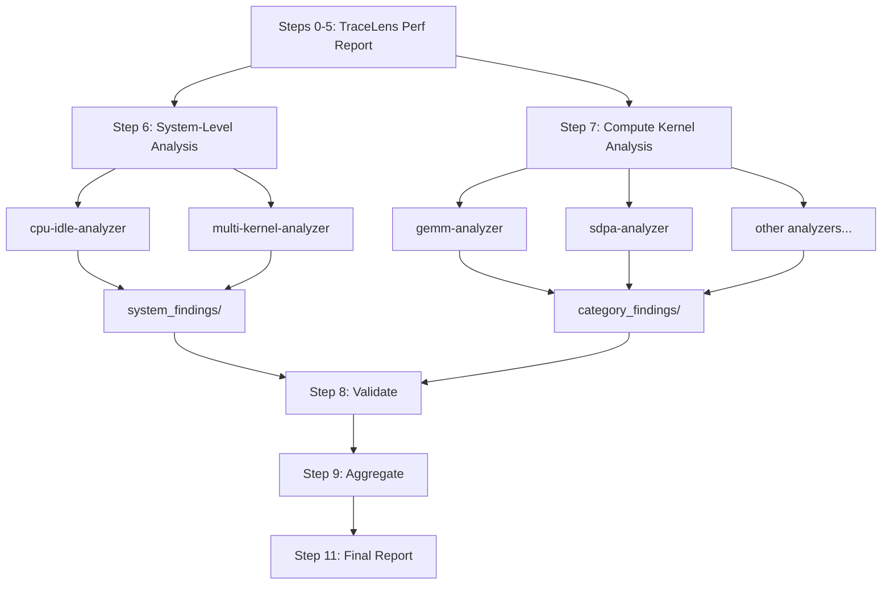

<!--
Copyright (c) 2024 - 2025 Advanced Micro Devices, Inc. All rights reserved.

See LICENSE for license information.
-->

# TraceLens Agentic Mode: Standalone Trace Analysis

> **⚠️ Experimental**: This feature is under active development and may change.

TraceLens Agentic Mode for Standalone Analysis is a Cursor-based AI-powered performance analysis tool that uses TraceLens to analyze PyTorch profiler traces and generate actionable optimization recommendations. The system supports automated analysis of training and inference traces supported by TraceLens. LLMs have been employed to define a structured workflow and interpret analysis results, combined with codified analysis to offer repeatability and reliability.

---

## Prerequisites

### 1. Clone TraceLens-internal

```bash
git clone https://github.com/AMD-AGI/TraceLens-internal.git
cd TraceLens
```

### 2. Install TraceLens inside your container

SSH into your node and exec into the container or venv:

```bash
ssh <node>
docker exec -it <container> bash
```

OR

```bash
ssh <node>
python -m venv venv_name
source venv_name/bin/activate
```

Install TraceLens:

```bash
cd /path/to/TraceLens-internal
pip install -e .
```

---

## Quick Start - How to Use

### To run performance analysis:

1. **In a Cursor (v2.5+) chat with Claude-4.6-Opus-High, invoke:**
  ```
   Run standalone analysis on <path_to_trace.json>
  ```
2. **Provide when prompted:**
  - Trace file path
  - Platform (MI300X/MI325X/MI350X/MI355X/MI400)
  - Node name and Container name or venv location
  - Output directory (optional)
3. **Get results:**
  - **Primary output**: `standalone_analysis.md` - Stakeholder report with prioritized recommendations
  - **Additional outputs:**
    - `system_findings/` - System-level analysis
    - `category_findings/` - Per-category compute kernel analysis

---

### Output Files

```
analysis_output/
├── standalone_analysis.md          # Stakeholder report
├── perf_report.xlsx                # Excel performance report
├── perf_report_csvs/               # CSV exports (gpu_timeline, ops_summary, etc.)
├── category_data/                  # Per-category CSVs, metrics JSONs, tree data
│   ├── category_manifest.json      # Category metadata, GPU utilization, tier info
│   ├── multi_kernel_data.json      # Pre-computed memcpy/NCCL/overlap data
│   ├── *_ops.csv
│   ├── *_metrics.json
│   └── *_tree_data.json
├── system_findings/                # System-level analysis (CPU/idle, multi-kernel)
│   └── *_findings.md
├── category_findings/              # Compute kernel analysis (markdown)
│   └── *_findings.md
└── metadata/                       # Category metadata JSONs
    └── *_metadata.json
```

---

## Architecture

### Two-Tier Analysis Overview

The analysis is split into two independent tiers that can be composed separately:

- **System-Level Optimizations** (Step 6): Issues that affect the GPU pipeline as a whole -- idle time, memcpy overhead, NCCL blocking, compute/comm overlap. These are not about individual kernel efficiency.
- **Compute Kernel Optimizations** (Step 7): Per-category kernel analysis (GEMM, SDPA, elementwise, etc.) focused on individual operation efficiency.

Each tier writes to a separate findings directory and produces an independently composable report section.




### Orchestrator

The **Standalone Analysis Orchestrator** skill coordinates the entire analysis workflow.
It queries user inputs, runs TraceLens to pre-compute trace data, and invokes system-level and compute kernel sub-agents in parallel. Finally, it validates outputs, aggregates findings, and generates a prioritized stakeholder report.

### Workflow Steps

```
0.   Query User Inputs (Platform, Trace Path, Node, Container)
1.   Generate Performance Report (perf_report.xlsx + CSVs)
2-5. Prepare Category Data (GPU Util, Top Ops, Tree Data, Multi-Kernel Data, Category Filtering)
6.   System-Level Analysis (CPU/Idle + Multi-Kernel, PARALLEL) → system_findings/
7.   Compute Kernel Subagents (PARALLEL) → category_findings/
8.   Validate Subagent Outputs (time sanity, efficiency anomalies, coverage)
9.   Aggregate Results: System-Level + Compute Kernel Recommendations
10.  Generate Replay Artifacts (optional)
11.  Generate Final Report (standalone_analysis.md)
```

### Sub-Agents

**System-Level (Step 6):**


| Agent                   | Purpose                                                               |
| ----------------------- | --------------------------------------------------------------------- |
| `cpu-idle-analyzer`     | Analyzes GPU idle time and CPU bottlenecks                            |
| `multi-kernel-analyzer` | Analyzes memcpy D2H/H2D patterns, NCCL blocking, compute/comm overlap |


**Compute Kernel (Step 7):**


| Agent                  | Purpose                                                                   |
| ---------------------- | ------------------------------------------------------------------------- |
| `gemm-analyzer`        | Analyzes matrix multiplication operations (mm, bmm, addmm)                |
| `sdpa-analyzer`        | Analyzes scaled dot-product attention (Flash, Paged)                      |
| `elementwise-analyzer` | Analyzes elementwise operations (add, mul, copy, etc.)                    |
| `reduce-analyzer`      | Analyzes reduction operations (mean, sum, softmax)                        |
| `triton-analyzer`      | Analyzes Triton-compiled kernels                                          |
| `moe-analyzer`         | Analyzes Mixture-of-Experts fused operations                              |
| `norm-analyzer`        | Analyzes normalization operations (BatchNorm, LayerNorm, GroupNorm, etc.) |
| `convolution-analyzer` | Analyzes convolution operations                                           |
| `generic-op-analyzer`  | Analyzes uncategorized operations (communication, graph, misc.)           |


## Extending Capability

The orchestrator's default workflow assumes a single eager-mode trace with standard perf report generation. For cases we're you'd like to add in custom preferences, you can override specific steps by providing instructions in the initial prompt. The normal analysis flow continues after the override.

**Example: Graph execution trace with capture-phase augmentation**

```
Run standalone analysis on <path_to_graph_trace.json>

This trace requires augmentation with capture-phase traces. Use this command for
perf report generation instead:

python TraceLens/Reporting/generate_perf_report_pytorch_vllm_graph.py \
  --capture_folder <path_to_capture_folder> \
  --graph_json_path <path_to_graph_trace.json> \
  --output_xlsx_path <output>.xlsx \
  --group_by_parent_module \
  --enable_pseudo_op

Once you change to this command, proceed with the normal flow.
Do not flag idle time as an issue because that is intentional.
Do not flag collectives as the main problem since that is a known problem.
```

This pattern generalizes: any step can be overridden or contextualized by adding instructions to the invocation prompt.

## Continual Learning

After an analysis run, if you identify a missed issue, ask Cursor to study why a particular issue was missed. Then, invoke the **Continual Learning** skill to update the relevant sub-agent's pattern library. It proposes minimal, append-only additions to the "Common Patterns" section of the appropriate analyzer so future runs catch similar issues automatically.

## Bug Reporting

Please include the following details when reporting an issue. Please use the TraceLens-internal private repo to share sensitive data.

- Description
- Software Version (PyTorch, Primus, vLLM, SGLang)
- Hardware (e.g., GPU model)
- Issue Observed
- Expected Behavior
- Scripts/Commands Used
- Error/Unexpected Behavior
- Trace Files Used for Analysis

## 🗺️ Roadmap

TraceLens Standalone Agentic analysis is currently an **experimental** feature.

### 🔄 In Progress

- Validation at a sub-agent level and integration tests are crucial to assess performance.

### 🚀 Future Improvements

- Individual analyzers require detailed review (performance thresholds, LLM vs codified) and restructuring (codify deterministic performance recommendations vs. deploy LLMs for open-ended analysis).
- Components of system-level analysis that can be codified should be moved into TraceLens.

