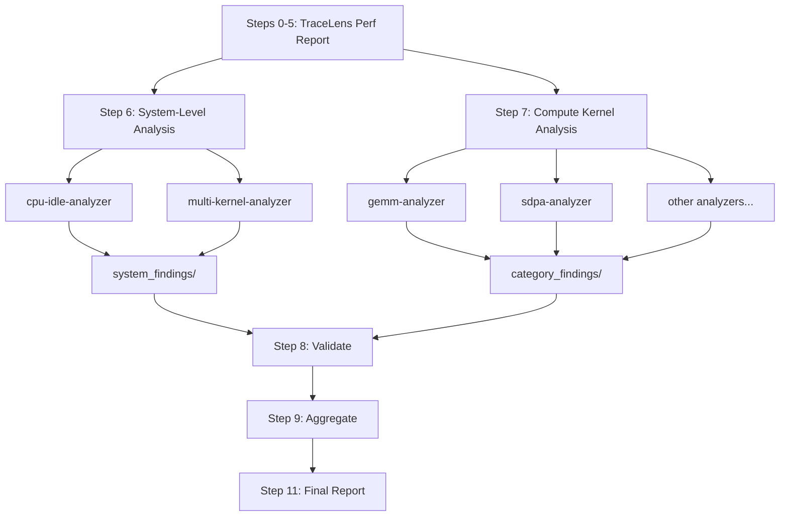

# TraceLens Agentic Mode

> **⚠️ Experimental**: This feature is under active development and may change.

TraceLens Agentic Mode is a Cursor-based AI-powered performance analysis tool that uses TraceLens to analyze PyTorch profiler traces and generate actionable optimization recommendations.

---

## Prerequisites

### 1. Clone and checkout the Agentic Orchestrator branch

```bash
git clone https://github.com/AMD-AGI/TraceLens.git
cd TraceLens
git checkout experimental/cursor-jarvis-orchestrator
```

### 2. Install TraceLens inside your container

SSH into your node and exec into the container where your traces reside:

```bash
ssh <node>
docker exec -it <container> bash
```

Install TraceLens:

```bash
cd /path/to/TraceLens
pip install -e .
```

---

## Quick Start - How to Use

### To run performance analysis:

1. **In a Cursor chat, invoke:**
   ```
   @standalone-analysis-orchestrator
   ```

   OR

   ```
   Run standalone analysis on <path_to_trace.json>
   ```


2. **Provide when prompted:**
   - Trace file path
   - Platform (MI300X/MI325X/MI355X/MI400)
   - Node name
   - Container name
   - Output directory (optional)

3. **Get results:**
   - `standalone_analysis.md` - Stakeholder report with prioritized recommendations
   - `system_findings/` - System-level analysis (CPU/idle, multi-kernel issues)
   - `category_findings/` - Per-category compute kernel analysis

---

## Output Files

```
analysis_output/
├── standalone_analysis.md          # Stakeholder report
├── perf_report.xlsx                # Excel performance report
├── perf_report_csvs/               # CSV exports (gpu_timeline, ops_summary, etc.)
├── category_data/                  # Per-category CSVs, metrics JSONs, tree data
│   ├── category_manifest.json      # Category metadata, GPU utilization, tier info
│   ├── multi_kernel_data.json      # Pre-computed memcpy/NCCL/overlap data
│   ├── *_ops.csv
│   ├── *_metrics.json
│   └── *_tree_data.json
├── system_findings/                # System-level analysis (CPU/idle, multi-kernel)
│   └── *_findings.md
├── category_findings/              # Compute kernel analysis (markdown)
│   └── *_findings.md
├── metadata/                       # Category metadata JSONs
│   └── *_metadata.json
└── replay_packages/                # Kernel replay artifacts (optional)
```

---

## Architecture

### Two-Tier Analysis Overview

The analysis is split into two independent tiers that can be composed separately:

- **System-Level Optimizations** (Step 6): Issues that affect the GPU pipeline as a whole -- idle time, memcpy overhead, NCCL blocking, compute/comm overlap. These are not about individual kernel efficiency.
- **Compute Kernel Optimizations** (Step 7): Per-category kernel analysis (GEMM, SDPA, elementwise, etc.) focused on individual operation efficiency.

Each tier writes to a separate findings directory and produces an independently composable report section.


### Orchestrator
The **Standalone Analysis Orchestrator** skill coordinates the entire analysis workflow.
It queries user inputs, runs TraceLens to pre-compute trace data, and invokes system-level and compute kernel sub-agents in parallel. Finally, it validates outputs, aggregates findings, and generates a prioritized stakeholder report.

### Workflow Steps

```
0.   Query User Inputs (Platform, Trace Path, Node, Container)
1.   Generate Performance Report (perf_report.xlsx + CSVs)
2-5. Prepare Category Data (GPU Util, Top Ops, Tree Data, Multi-Kernel Data, Category Filtering)
6.   System-Level Analysis (CPU/Idle + Multi-Kernel, PARALLEL) → system_findings/
7.   Compute Kernel Subagents (PARALLEL) → category_findings/
8.   Validate Subagent Outputs (time sanity, efficiency anomalies, coverage)
9.   Aggregate Results: System-Level + Compute Kernel Recommendations
10.  Generate Replay Artifacts (optional)
11.  Generate Final Report (standalone_analysis.md)
```

### Continual Learning
After an analysis run, if you identify a missed issue, ask Cursor to study why a particular issue was missed. Then, invoke the **Continual Learning** skill to update the relevant sub-agent's pattern library. It proposes minimal, append-only additions to the "Common Patterns" section of the appropriate analyzer so future runs catch similar issues automatically.

### Sub-Agents

**System-Level (Step 6):**

| Agent | Purpose | Invocation Condition |
|-------|---------|---------------------|
| `cpu-idle-analyzer` | Analyzes GPU idle time and CPU bottlenecks | `idle_time_percent > 50%` |
| `multi-kernel-analyzer` | Analyzes memcpy D2H/H2D patterns, NCCL blocking, compute/comm overlap | Multi-kernel category exists in manifest |

**Compute Kernel (Step 7):**

| Agent | Purpose |
|-------|---------|
| `gemm-analyzer` | Analyzes matrix multiplication operations (mm, bmm, addmm) |
| `sdpa-analyzer` | Analyzes scaled dot-product attention (Flash, Paged) |
| `elementwise-analyzer` | Analyzes elementwise operations (add, mul, copy, etc.) |
| `reduce-analyzer` | Analyzes reduction operations (mean, sum, softmax) |
| `triton-analyzer` | Analyzes Triton-compiled kernels |
| `moe-analyzer` | Analyzes Mixture-of-Experts fused operations |
| `batchnorm-analyzer` | Analyzes batch normalization |
| `convolution-analyzer` | Analyzes convolution operations |
| `generic-op-analyzer` | Analyzes uncategorized operations (communication, graph, misc.) |

### Constraints
TraceLens Agentic Mode typically handles the categorized kernels, though the `generic-op-analyzer` is found to be capable for general recommendations. Additionally, complex system-level issues may not be fully uncovered beyond the patterns detected by the `cpu-idle-analyzer` and `multi-kernel-analyzer`.
