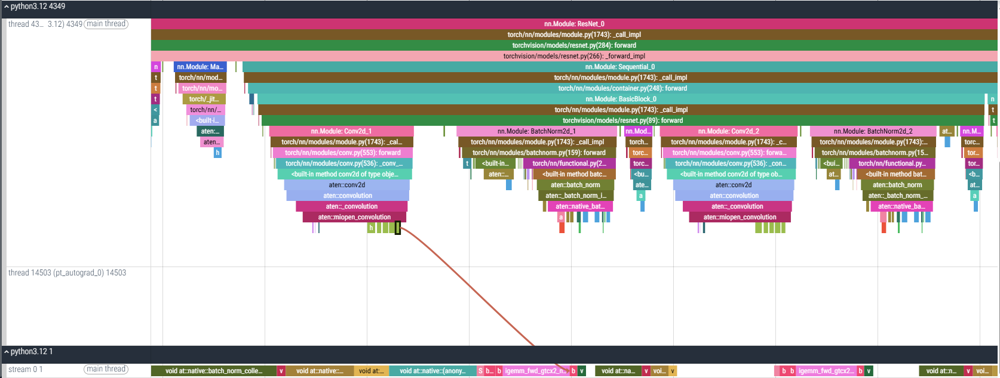
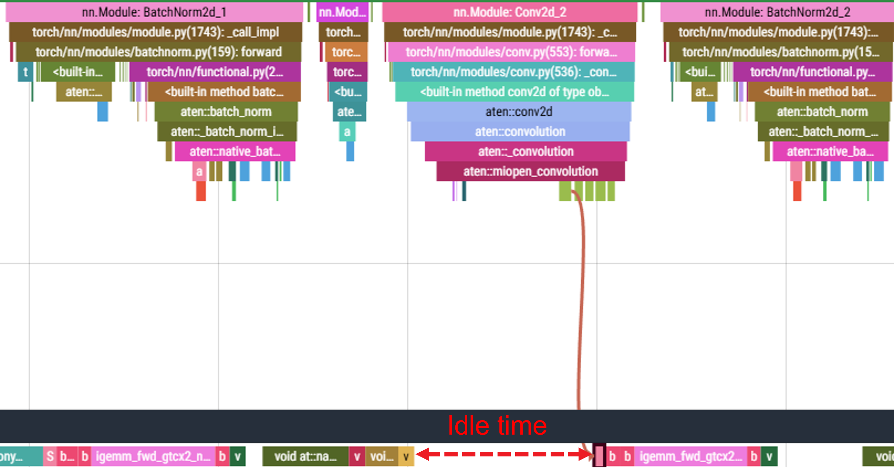
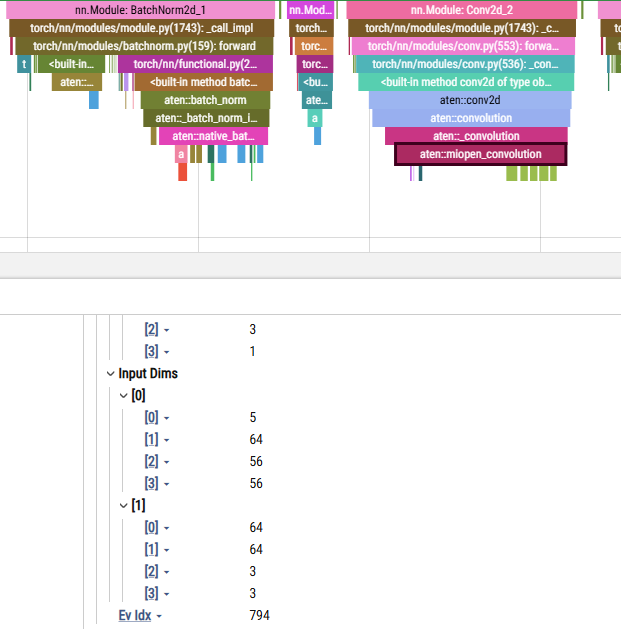
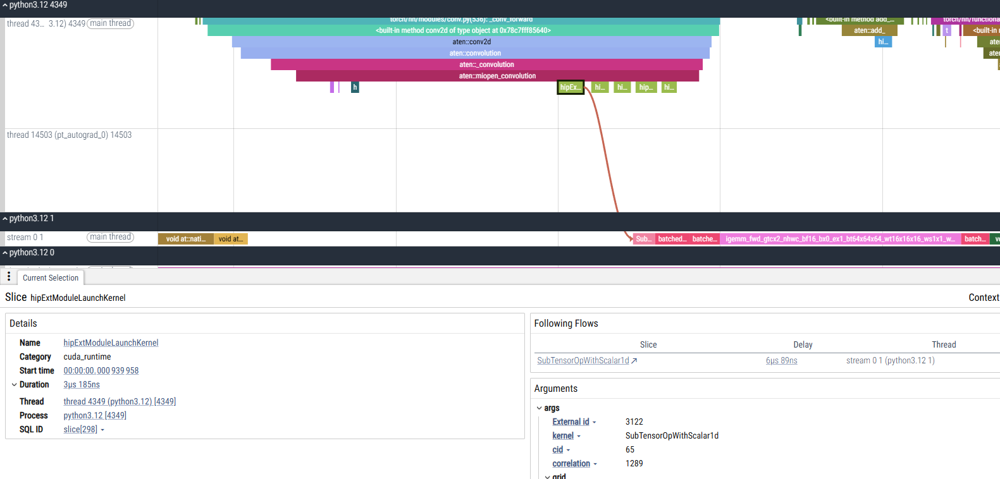
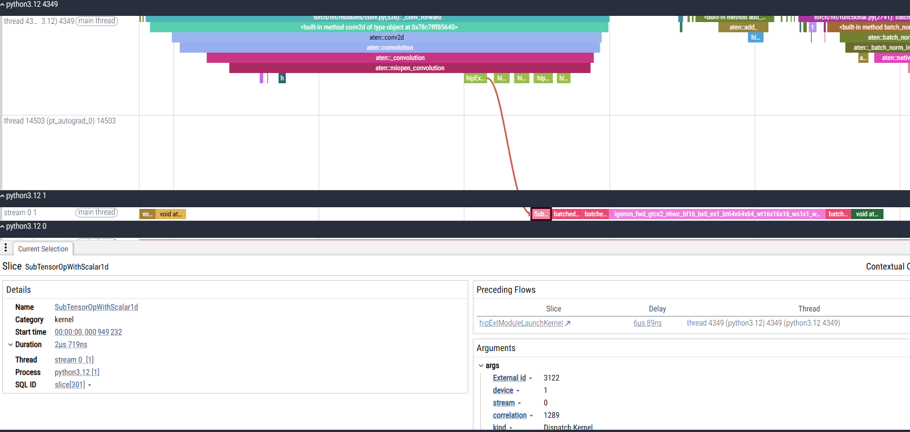
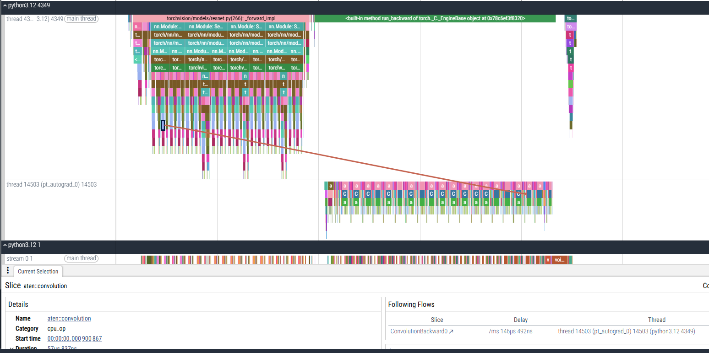

<!--
Copyright (c) 2025 - 2026 Advanced Micro Devices, Inc. All rights reserved.

See LICENSE for license information.
-->

# Understanding PyTorch traces
```{meta}
:description: A conceptual walkthrough of how PyTorch traces capture host and GPU execution, how a single Python operation expands into GPU kernels, and how to read a single-GPU trace in Perfetto.
:keywords: PyTorch profiler, trace analysis, Perfetto, GPU kernels, ATen, MIOpen, cuDNN, host device execution, tensor shapes, autograd, memory copy, TraceLens
```

Once you've collected a PyTorch trace and opened it in [Perfetto](https://ui.perfetto.dev/), the next question is what the trace actually means and how you read insights from it. This topic unpacks that for a *single-GPU* trace. Multi-GPU profiling is covered separately.

When you run a PyTorch model on a GPU, there's a hidden interplay between the CPU (host) and the GPU (device). A PyTorch trace lets you observe this choreography, revealing how your code executes, where time is spent, and what might be slowing you down.

## The execution model: host, GPU, and asynchronous launches



*Figure 1: Asynchronous execution example.*

To understand profiling, you need a mental model of how PyTorch — or any application — runs code across the CPU and GPU.

The host (CPU) is the conductor. It manages processes and threads, moving through the application call stack until it issues GPU runtime or driver application programming interface (API) calls such as `cudaLaunchKernel` or `hipLaunchKernel`. The GPU is the performer. It executes tasks with massive parallelism, often involving thousands of threads working on matrix multiplications, convolutions, or reductions.

Most of these commands are asynchronous. The host queues the commands (kernels) and immediately continues, while the GPU independently drains its queue. This overlap is what enables high performance. Sometimes, however, the host introduces synchronization points such as `cudaDeviceSynchronize` or `hipDeviceSynchronize`. In those cases the CPU waits until the GPU finishes all queued work. Synchronization is necessary for correctness, but too many synchronizations can quickly turn into bottlenecks.

One more distinction: host events come with detailed call stacks (Python to C++ to runtime), so you can see exactly how an operation was triggered. GPU events, on the other hand, are flat. A GPU kernel can't call another GPU kernel on its own — the launch must always come from the host. That's why GPU traces appear as a simple queue of kernels, memory copies, and memory sets with no stack information.

A kernel itself is just a GPU function that runs across thousands of lightweight threads in parallel. In the trace, each kernel shows up as a single event: you can see when it started, how long it ran, and on which stream — but not what happened inside. To inspect that level of detail (thread execution, memory transactions, warp occupancy), you need dedicated kernel profilers such as [rocprof-compute](https://rocm.docs.amd.com/projects/rocprofiler-compute/en/latest/) for AMD GPUs or Nsight Compute for NVIDIA GPUs. These tools complement the trace view by showing what happens inside the GPU during a kernel event.

## A simple example

To dig deeper into what a trace shows, consider the snippet below.



*Figure 2: Perfetto trace highlighting idle time between convolution and batch normalization kernels.*

The red dashed region marks idle time: the GPU is waiting for the host to issue the next command. This happens when the CPU frontend can't keep up with the GPU's execution speed. Reducing such idle gaps is an important optimization goal. To see why these gaps occur, follow the path from a high-level PyTorch call down to the GPU kernels that actually run.

Take a simple example:

```python
y = nn.Conv2d(3, 64, kernel_size=3)(x)
```

At the Python level, this looks like a single operation. In the trace, however, it expands into several layers:

- **Python frontend**: `nn.Conv2d` in `torch.nn`.
- **ATen**: the call lowers into PyTorch's tensor library, [ATen](https://docs.pytorch.org/cppdocs/#aten), and shows up as `aten::conv2d` in the trace.
- **Backend wrapper**: ATen provides wrappers that call into vendor libraries. On AMD GPUs, you'll see `aten::miopen_convolution`, which wraps [MIOpen](https://rocm.docs.amd.com/projects/MIOpen/en/latest/) commands. On NVIDIA GPUs, the equivalent is `aten::cudnn_convolution`, which wraps [cuDNN](https://developer.nvidia.com/cudnn) calls.
- **GPU kernels**: the backend library enqueues device kernels such as `igemm_fwd_gtcx2_nhwc` that perform the actual convolution on the GPU.

This gives a clear understanding of how high-level code is translated into GPU execution.

## Tensor metadata in the trace

Another important detail is tensor metadata. Python-level operations in the trace don't carry shape information. But if you enable `record_shapes=True` in the profiler, the `cpu_op` category (such as `aten::convolution`) includes input shapes, strides, and dtypes.

For example, in the figure below the first tensor is the activation (`[5, 64, 56, 56]`) and the second tensor is the convolution filter (`[64, 64, 3, 3]`).



*Figure 3: Shapes recorded on the backend op when `record_shapes=True`.*

This metadata becomes very useful for deeper analysis and debugging — for example, when matching trace events to model architecture, analyzing kernel efficiency, or spotting unusual stride or dtype patterns.

That's all you need for a clean first pass: know what the host and GPU are doing, read the timeline, and use recorded shapes to ground what you see. Perfetto gives you the raw signals; turning them into insight is a skill you build with practice, and TraceLens helps accelerate that process.

The appendix below covers UI shortcuts, how memory copies show up, and the structure of the raw trace file.

## Perfetto tips and trace internals

### Perfetto UI tips

Perfetto is a powerful trace viewer, but it takes some practice to navigate effectively. A few basics:

- **Zoom and pan** with `Ctrl + scroll` to zoom in and out; click and drag to pan.
- **Event details**: click any event to open the *Current Selection* panel below. This shows start time, duration, and arguments. With `record_shapes=True`, backend ops (in the `cpu_op` category) also show tensor shapes, dtypes, and strides.

Perfetto also links host launches and GPU execution with arrows called *flows*. These are crucial for connecting what you see on the CPU timeline with what actually runs on the GPU.

When you select a runtime launch event such as `hipExtModuleLaunchKernel`, the *Following Flow* jumps you forward to the GPU kernel it triggered:



*Figure 4: Following flow from a host launch (`hipExtModuleLaunchKernel`) to the corresponding GPU kernel event.*

Conversely, when you select a GPU kernel event, the *Preceding Flow* takes you back to the runtime call on the host that launched it:



*Figure 5: Preceding flow from a GPU kernel (`SubTensorOpWithScalar1d`) back to its launch on the host.*

These flows are the bridge between the Python-level trace and the GPU execution timeline. They let you answer both:

- Which Python or ATen op caused this kernel to run?
- What GPU work did this runtime call produce?

### Memory copy events

Not all GPU activity is compute. Profiling traces also show memory transfers:

- **H2D (host to device)**: copies data from CPU to GPU, usually synchronous and PCIe bandwidth-limited.
- **D2H (device to host)**: copies results back to CPU, also synchronous and PCIe bandwidth-limited.
- **D2D (device to device)**: moves data between GPU buffers, asynchronous and limited by HBM bandwidth.

Recent versions even record measured bandwidth for these events in the trace arguments. Importantly, memory copy events use the GPU's DMA engines, not compute cores, so they don't directly compete with kernel execution.

### JSON format

Behind the Perfetto UI, the PyTorch profiler saves traces as JSON. Each entry is an event dictionary with:

- **Timestamps**: `ts` (start) and `dur` (duration).
- **Process and thread IDs**: `pid` and `tid`. CPU events use real PIDs and TIDs; GPU events use pseudo-PIDs for devices and TIDs for streams.
- **Category**: for example, `python_function`, `cpu_op`, `cuda_runtime`, `kernel`, or `gpu_memcpy`.
- **Args**: extra information such as shapes, dtypes, strides, or bandwidth.

The JSON format makes traces scriptable: you can parse them to build custom reports or run automated analysis outside Perfetto. This is exactly what TraceLens does.

### Autograd in the trace

Autograd introduces another dimension to the trace: the forward and backward passes are captured on different threads within the same process. In the timeline, you typically see:

- `python3.x [main thread]` for the forward pass.
- `pt_autograd_0` (or similar) for the backward pass.

These are linked at the `aten::convolution` layer of the call stack. Perfetto uses flows to connect the forward convolution op to its corresponding backward node.



*Figure 6: Example of `aten::convolution` (forward) linked to `ConvolutionBackward0` (backward) through flows.*

Key points:

- The linkage happens at `aten::convolution`, not `aten::conv2d`. The higher-level `aten::conv2d` call funnels into `aten::convolution` before reaching the backend.
- Forward and backward both eventually call into the same GPU backend (MIOpen or cuDNN), so you see similar kernel launches in both directions.
- The backward pass typically runs more kernels, since it must compute gradients for both activations and weights, making it more expensive than the forward pass.
- Because autograd runs on its own thread, you can separate model execution (forward path) from gradient computation (backward path) when analyzing traces.

Together with the flows discussed earlier, this lets you connect a forward convolution op to its exact backward counterpart and then follow the chain down to GPU kernels.

## Related topics

- [Trace2Tree](../conceptual/trace2tree.md)
- [GEMM analysis](../conceptual/gemm-analysis.md)
- [Generate a performance report from PyTorch traces](../how-to/generate-perf-report-pytorch.md)
- [TraceLens metrics](../reference/tracelens-metrics.md)
- [What is TraceLens?](../what-is-tracelens.md)
