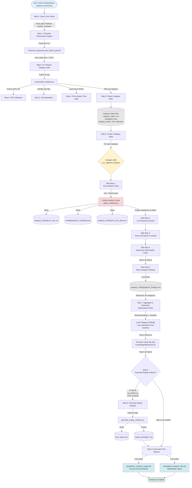

# JARVIS Performance Analysis - Cursor AI Skill

> **⚠️ EXPERIMENTAL - NOT OFFICIAL**
> 
> This is a highly experimental feature and is **not officially supported**. Use at your own risk. The skill methodology, output format, and behavior may change significantly without notice. Feedback and contributions are welcome!

JARVIS is an AI-powered performance analysis agent that uses TraceLens to analyze PyTorch profiler traces and generate actionable optimization recommendations.

## What is a Cursor Skill?

[Cursor](https://cursor.com) is an AI-powered code editor. **Skills** are modular instruction files that teach Cursor's AI agent domain-specific workflows. When you ask Cursor to analyze a trace, the JARVIS skill provides the methodology, commands, and best practices automatically.

## Requirements

- **Cursor IDE** version 2.4 or later (Skills feature added Jan 22, 2026)
- **TraceLens** installed in your Python environment

