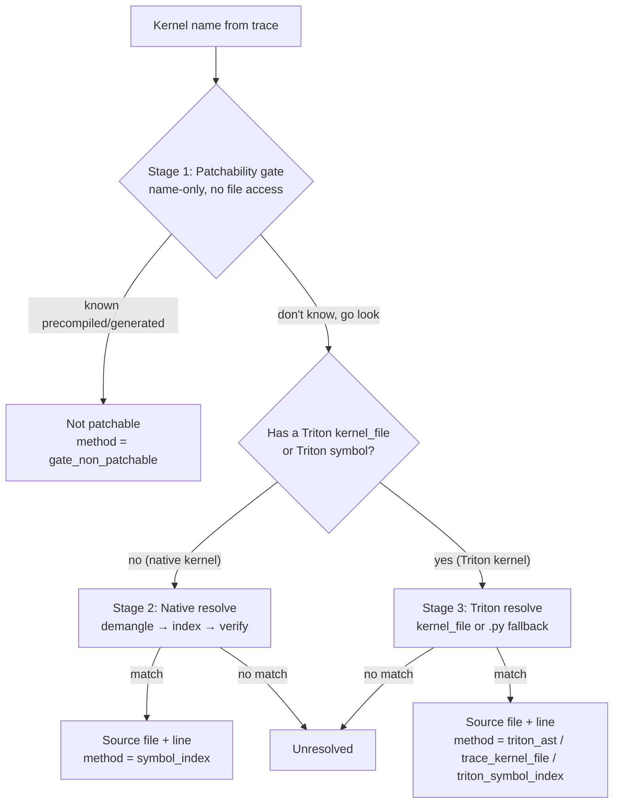

<!--
Copyright (c) 2024 - 2026 Advanced Micro Devices, Inc. All rights reserved.

See LICENSE for license information.
-->


# Map a GPU kernel to its source in TraceLens

This document explains how TraceLens takes a raw GPU kernel name from a trace and
finds the **editable source file and line** that defines it — or tells you why
there is no source you can edit. This is the TraceLens "kernel source mapping" feature.

A profiler records the *name* of every GPU kernel that ran, but not where its
code lives. Some kernels come from source you can open and change (a `.cu`,
`.hip`, or a Triton `.py`); others are precompiled libraries or generated at
compile time and have no source to edit. Kernel source mapping answers two
questions for each kernel:

1. **Can this kernel be edited at all?** (or is it precompiled/generated?)
2. **If yes, which file and line define it?**

## Before you begin

- TraceLens installed (see [Install TraceLens](../install/install.md)). For the
  best kernel-name decoding, install the `kernel_source` extra so the
  `itanium-demangler` package is present:

  ```bash
  pip install "tracelens[kernel_source]"
  ```

- The framework whose kernels you want to map should be installed in the same
  environment (for example `vllm`, `sglang`, or `aiter`). TraceLens finds their
  source on disk by locating the installed package — see
  [How frameworks are discovered](#how-frameworks-are-discovered).

## How it works at a glance

Mapping runs as a three-stage pipeline. Each stage is cheaper than the next, so
an obvious "no" is returned before any expensive work happens.



The result of a mapping is always a `ResolveResult` (see
[Understanding the result](#understanding-the-result)) that carries the verdict,
the file/line when found, and a `method` string saying how the answer was
reached.

## Stage 1: The patchability gate

The gate is a quick, **name-only** check that does no file access. It rules out
kernels that are known to be precompiled or compiler-generated, so TraceLens
doesn't waste time searching for source that can't exist.

It looks at the kernel name (and, when available, the launching op name and the
call stack) and rejects these categories:

| Category | How it's recognized | `kind` |
|---|---|---|
| Tensile GEMM | name starts with `Cijk_` (precompiled assembly) | `tensile_precompiled` |
| MIOpen convolution | op name contains `miopen` | `miopen_precompiled` |
| Inductor Triton | `torch.compile` name (`triton_poi_`, `triton_red_`, …) or a call-stack frame in the inductor cache | `triton_inductor_generated` |
| Composable Kernel | the `ck::` / `ck_tile::` namespace in the (demangled) name | `aiter_ck` |

The gate gives one of two answers, never a firm "yes":

- **"No, not patchable"** — the name matches a known precompiled/generated
  category above, so TraceLens stops here and skips the file search.
- **"Not sure — go look"** — the name doesn't match any known category, so
  TraceLens moves on to actually search for the source (Stage 2 or 3).

The reason it never says "yes" is that a name alone can't prove a source file
really exists on disk. Confirming that is the job of the later stages, which
open the source tree and check.

## Stage 2: Native source resolution

For a native kernel (a `.cu`/`.cuh`/`.hip`/`.h`/`.hpp` definition), TraceLens
runs an "active finder": it searches the installed frameworks' source trees for
the file that defines the kernel. The steps are:

1. **Normalize the name.** A profiler may report a kernel three ways — a plain
   name, a full C++ signature, or a mangled `_Z...` symbol. TraceLens reduces
   all three to the bare name (for example `_ZN2ns6kernelEPf` →
   `kernel`). Mangled names are decoded with the `itanium-demangler` package,
   with a small built-in parser as a fallback.
2. **Look up the name in the index.** TraceLens builds a
   `kernel-name → source-file` index over the discovered source trees (see
   [How frameworks are discovered](#how-frameworks-are-discovered)) and looks up
   the bare name.
3. **Rank the candidates.** If several files define the same name, TraceLens
   prefers a file whose path matches the target GPU architecture (set via
   `TRACELENS_TARGET_ARCH`), then the shortest path.
4. **Verify the symbol is really there.** TraceLens opens the top candidate and
   confirms the name actually appears in the file, guarding against a stale
   index.
5. **Check editability.** The path must be an editable source (see
   [What counts as editable](#what-counts-as-editable)).

On success the result has `method = "symbol_index"` and the resolved file (plus
a line when known). On a miss the result is `unresolved`.

## Stage 3: Triton source resolution

Triton kernels are Python (`@triton.jit`) rather than native code, so they are
resolved differently. There are two paths, depending on what the trace recorded.

### Path A — the trace has a `kernel_file`

Newer PyTorch/Kineto traces already tell you the file: they record a
`kernel_file` field for Triton launches, such as
`/repo/moe.py:120:grouped_gemm` (a file path, a line, and the function name).

When that field is present, TraceLens does three things:

1. **Reads the file path** out of that string.
2. **Checks it's real source, not a generated file.** If the path is inside a
   compile cache or under `/tmp`, it's throwaway generated code with nothing to
   edit, so the answer is "not patchable" (`gate_non_patchable`).
3. **Finds the exact definition line.** TraceLens opens the `.py` file and reads
   its structure to locate the `@triton.jit` function, so it can point at the
   `def` line even if the line number in the trace was slightly off.

If TraceLens pinned the line by reading the file, the method is `triton_ast`. If
it could only use the path from the trace (without opening the file), the method
is `trace_kernel_file`.

### Path B — no `kernel_file`, but the symbol is known (fallback)

Older traces don't carry `kernel_file`. In that case, if the kernel's symbol is
known, TraceLens falls back to a **symbol search over `.py` files**:

- It builds a cached index of every `@triton.jit` (and `@autotune` /
  `@heuristics`) function in the discovered frameworks' `.py` files.
- To keep this fast, it first does a cheap text pre-filter — only files that
  contain the word `triton` are parsed with the AST.
- It then ranks matches: an exact (normalized) name match beats a partial
  match, and among equal matches the shortest path wins.
- Generated Triton paths are filtered out via the editability check.

A hit here has `method = "triton_symbol_index"`.

## How frameworks are discovered

TraceLens doesn't hardcode source locations. It locates the installed packages
and scans their source trees. This "discovery" step:

- Locates a set of known serving frameworks by name (`vllm`, `sglang`, `aiter`,
  `atom`) using the Python import system, and also auto-detects any other
  installed package that ships native kernel source.
- For each, finds the native-source directories (for example a `csrc/` folder)
  and records the package version.
- Returns the package roots so the native index and the Triton `.py` index know
  where to scan.

You can steer discovery with environment variables (see
[Environment variables](#environment-variables)).

### Index caching

Walking the source trees takes a moment, so TraceLens does it once and reuses
the result. The index is saved in two places:

- **In memory**, for the rest of the current run — so looking up more kernels in
  the same run costs nothing.
- **On disk**, so even a brand-new run can reuse the index instead of
  rebuilding it. By default this goes in the system temp directory under a
  per-user subfolder (for example `/tmp/tracelens_ksi_1000/`), not your current
  working directory. Set `TRACELENS_KSI_CACHE_DIR` to choose a different
  location.

To know when the saved index is stale, TraceLens stamps it with a quick
*fingerprint* of the source tree: the newest file's modification time and the
number of files. If you add, remove, or edit a source file, the fingerprint
changes and the index rebuilds automatically; otherwise the saved copy is used
as-is. The native (`.cu`/`.hip`/…) index and the Triton `.py` index are
fingerprinted and cached separately, so changing one doesn't force the other to
rebuild.

## What counts as editable

A path is treated as **editable** when it is:

- native device code — `.cu`, `.cuh`, `.hip`, `.h`, `.hpp`, or
- a repository-resident Triton `.py`.

It is **not** editable when it is compiler-generated Triton — a file in an
inductor/compile cache (`torchinductor`, `inductor_cache`, `torch_compile_cache`)
or anything under `/tmp/`. Those are produced at compile time and have no
durable source to rewrite.

## Use it from the command line

The `TraceLens_resolve_kernel_source` command resolves one kernel and prints the
result as JSON.

```bash
# Native kernel, with explicit search paths:
TraceLens_resolve_kernel_source --kernel _Z12my_kernelPf \
    --search-path /opt/vllm/csrc --search-path /opt/aiter/csrc

# Triton kernel from a trace kernel_file:
TraceLens_resolve_kernel_source \
    --triton-kernel-file "/repo/moe.py:120:kernel"
```

| Flag | Meaning |
|---|---|
| `--kernel` | Device kernel name/symbol (native or plain). |
| `--search-path DIR` | A directory to search for native sources (repeatable). When omitted, defaults are auto-discovered. |
| `--op-name` | Launching op name (used by the gate, e.g. MIOpen). |
| `--call-stack-file` | File with one call-stack frame per line (a CLI convenience; integrated callers pass frames through the API). |
| `--triton-kernel-file` | Resolve a Triton `.py` kernel from this trace `kernel_file` instead of a native symbol. |

## Use it from Python

```python
from TraceLens.TraceUtils.kernel_source import resolve, resolve_triton_source

# Native kernel: runs the gate, then the active finder.
res = resolve("_Z24reshape_and_cache_kernelPfPKf", ["/opt/vllm/csrc"])
if res.patchable:
    print(res.source_file, res.line, res.method)  # e.g. .../cache_kernels.hip 84 symbol_index
else:
    print("not patchable:", res.kind, res.reason)

# Triton kernel from a trace kernel_file:
tri = resolve_triton_source("/repo/moe.py:120:grouped_gemm")
print(tri.source_file, tri.line, tri.method)  # .../moe.py 120 triton_ast
```

`resolve()` is the one-call "gate + resolve" entry point for native kernels.
`resolve_source_path()` is available if you only want the index lookup (for
example when you've already run the gate upstream).

## Understanding the result

Every mapping returns a `ResolveResult` with these fields:

| Field | Meaning |
|---|---|
| `source_file` | Resolved file path, or `""` when there is no location. |
| `line` | 1-based definition line when known, else `None`. |
| `patchable` | Whether an editable source exists for this kernel. |
| `kind` | Non-patchable category when applicable (see the gate table). |
| `reason` | Short human-readable explanation. |
| `method` | How the answer was reached (see below). |

The `method` tells you which path produced the answer:

| `method` | Meaning |
|---|---|
| `gate_non_patchable` | The gate (or a generated Triton path) ruled it out. |
| `symbol_index` | Native kernel found via the source index. |
| `triton_ast` | Triton `.py` found and the definition line pinned from the file. |
| `trace_kernel_file` | Triton `.py` path from the trace, without a pinned line. |
| `triton_symbol_index` | Triton `.py` found via the symbol-search fallback (no `kernel_file`). |
| `unresolved` | No editable source found. |

## Environment variables

| Variable | Effect |
|---|---|
| `TRACELENS_TARGET_ARCH` | Prefer candidate files whose path matches this GPU architecture during ranking. |
| `TRACELENS_KSI_CACHE_DIR` | Directory for the on-disk index cache (defaults to a per-user temp folder). |
| `TRACELENS_FRAMEWORK_SOURCE_ROOTS` | Explicit `name=path` framework roots (comma-separated), overriding auto-discovery. |
| `TRACELENS_DISCOVER_ONLY` | Restrict discovery to this comma-separated allowlist of framework names. |
