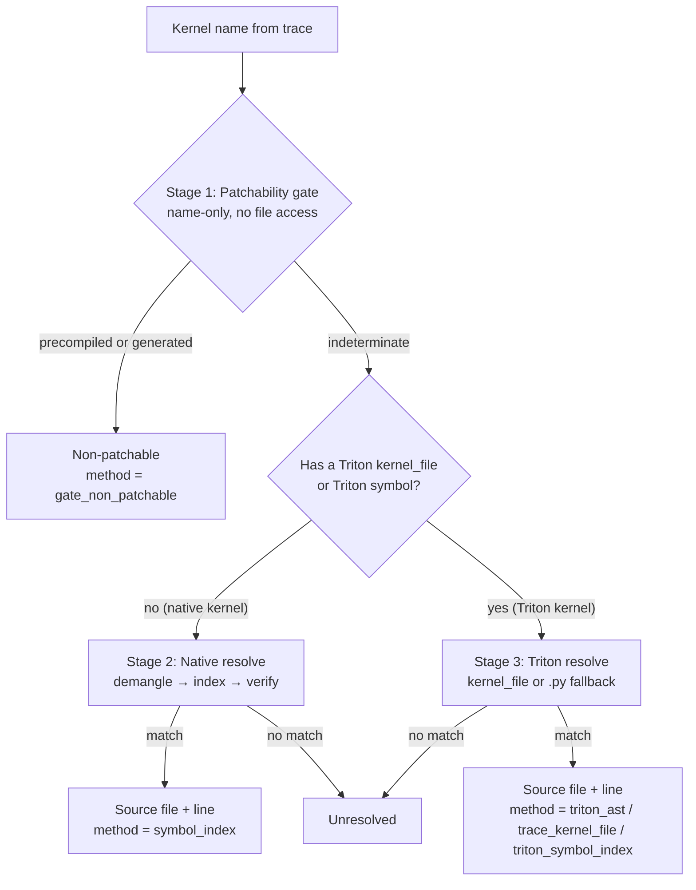

<!--
Copyright (c) 2026 Advanced Micro Devices, Inc. All rights reserved.

See LICENSE for license information.
-->


# Map a GPU kernel to its source in TraceLens
```{meta}
:description: Learn how TraceLens resolves a GPU kernel name from a profiler trace to the source file and line that defines it, and how it classifies precompiled and generated kernels that have no editable source.
:keywords: TraceLens, kernel source mapping, patchability, demangling, Triton, Composable Kernel, Tensile, MIOpen, ROCm, PyTorch profiler, symbol index
```

This topic shows how to resolve a GPU kernel name from a profiler trace to the
source file and line that defines it, and how TraceLens reports the kernels that
have no editable source at all.

A [performance report](./generate-perf-report-pytorch.md) ends with a ranked list
of the kernels that dominate GPU time. Acting on that list means editing the
kernels it names, and that first requires knowing where each one is defined. A
profiler records the name of every GPU kernel that ran, but not the location of
its code.

Some kernels are defined in source you can modify, a `.cu`, `.hip`, or a Triton
`.py`, while others are precompiled library code or generated at compile time and
cannot be edited at all. Kernel source mapping resolves both cases: for each
kernel it reports whether an editable definition exists and, when it does, the
file and line that hold it.

## Before you begin

- TraceLens installed (see [Install TraceLens](../install/install.md)). Install
  the `kernel_source` extra so the `itanium-demangler` package is available for
  symbol decoding:

  ```bash
  pip install "tracelens[kernel_source]"
  ```

- The framework whose kernels you want to map installed in the same environment
  (for example `vllm`, `sglang`, or `aiter`). TraceLens locates the installed
  package to find its source on disk — see
  [How frameworks are discovered](#how-frameworks-are-discovered).

## How it works at a glance

Mapping runs as a three-stage pipeline, ordered by cost. The name-only gate runs
first so that kernels with no possible source are rejected before any filesystem
access.



The command line reports every mapping as a `ResolveResult` (see
[Understanding the result](#understanding-the-result)): the verdict, the file
and line when resolved, and a `method` string identifying the path that produced
the answer. The stages are described in
[Stage 1: The patchability gate](#stage-1-the-patchability-gate) onward.

## Resolve a kernel from the command line

The `TraceLens_resolve_kernel_source` command resolves one kernel and prints the
result as JSON.

```bash
# Native kernel, with explicit search paths:
TraceLens_resolve_kernel_source --kernel _Z12my_kernelPf \
    --search-path /opt/vllm/csrc --search-path /opt/aiter/csrc

# Triton kernel from a trace kernel_file:
TraceLens_resolve_kernel_source \
    --triton-kernel-file "/repo/moe.py:120:kernel"
```

| Flag | Meaning |
|---|---|
| `--kernel` | Device kernel name/symbol (native or plain). |
| `--search-path` | A directory to search for native sources. Repeatable. When omitted, defaults are auto-discovered. |
| `--op-name` | Launching op name. The gate uses it only to identify MIOpen convolutions. |
| `--triton-kernel-file` | Resolve a Triton `.py` kernel from the trace event object's kernel_file field instead of a native symbol. |

## Resolve a kernel from Python

A native kernel takes two calls: run the gate, then resolve the survivors.

```python
from TraceLens.TraceUtils.kernel_source import (
    classify_patchability,
    resolve_source_path,
    resolve_triton_source,
)

kernel = "_Z24reshape_and_cache_kernelPfPKf"

gate = classify_patchability(kernel)
if gate.patchable is False:
    print("not patchable:", gate.kind, gate.reason)
else:
    loc = resolve_source_path(kernel, ["/opt/vllm/csrc"])
    if loc is not None:
        print(loc.source_file, loc.line)  # e.g. .../cache_kernels.hip 84
```

A Triton kernel takes one call, because `resolve_triton_source()` applies the
editability check itself:

```python
tri = resolve_triton_source("/repo/moe.py:120:grouped_gemm")
print(tri.source_file, tri.line, tri.method)  # .../moe.py 120 triton_ast
```

The two entry points return different types. `resolve_source_path()` returns a
`SourceLocation`, or `None` when nothing matched, so a caller that wants a full
verdict pairs it with `classify_patchability()` and builds the
`ResolveResult` itself — this is what the CLI does.
`resolve_triton_source()` returns a `ResolveResult` directly.

## Understanding the result

`ResolveResult` is what the CLI prints and what `resolve_triton_source()`
returns. It carries these fields:

| Field | Type | Meaning |
|---|---|---|
| `source_file` | `str` | Resolved file path, or `""` when there is no location. |
| `line` | `int` or `None` | The line the kernel's definition starts on, numbered from 1 the way an editor shows it. `None` when the line could not be determined. |
| `framework` | `str` | Discovered package the file came from, for example `vllm`; `""` when not attributed. Held on the nested `SourceLocation` and flattened into the CLI JSON. |
| `patchable` | `bool` | Whether an editable source exists for this kernel. |
| `kind` | `str` | Non-patchable category when applicable, as listed in [Stage 1: The patchability gate](#stage-1-the-patchability-gate). Empty when no category applied. |
| `reason` | `str` | Short human-readable explanation. Empty when there is nothing to explain. |
| `method` | `str` | How the answer was reached. Always one of the six values below. |

`method` is a single string. It takes one of these values:

| Value | Meaning |
|---|---|
| `gate_non_patchable` | Rejected before any file was opened, either by the [patchability gate](#stage-1-the-patchability-gate) or because the Triton path pointed into a compile cache. |
| `symbol_index` | The kernel name was found in the index of kernel names to source files that TraceLens builds over the installed frameworks, and the file was then opened to confirm the name really appears in it. See [Stage 2: Native source resolution](#stage-2-native-source-resolution). |
| `triton_ast` | The trace supplied a Triton `.py` path, and TraceLens parsed the file to locate the exact `def` line. See [Stage 3: Triton source resolution](#stage-3-triton-source-resolution). |
| `trace_kernel_file` | The trace supplied a Triton `.py` path, but the `def` line was not pinned by reading the file, so no line is reported. |
| `triton_symbol_index` | The trace recorded no `kernel_file`, so the kernel name was matched against an index of `@triton.jit` functions in the installed `.py` sources. |
| `unresolved` | The kernel passed the gate, but no definition for it was found in any discovered source tree. |

### Example results

Results take one of three shapes. A resolved kernel fills in the location and
leaves `kind` and `reason` empty, because the gate never rejected it:

```json
{
  "source_file": "/opt/vllm/csrc/cache_kernels.hip",
  "line": 84,
  "framework": "vllm",
  "patchable": true,
  "kind": "",
  "reason": "",
  "method": "symbol_index"
}
```

A kernel the gate rejected has no location, so `source_file` is empty and `line`
is `null`. Here `kind` and `reason` carry the category and its explanation:

```json
{
  "source_file": "",
  "line": null,
  "framework": "",
  "patchable": false,
  "kind": "tensile_precompiled",
  "reason": "Tensile precompiled GEMM (.co assembly)",
  "method": "gate_non_patchable"
}
```

A kernel that passed the gate but matched nothing in the index also has no
location, but `kind` stays empty because no category applied. Only the `method`
distinguishes this case from the one above:

```json
{
  "source_file": "",
  "line": null,
  "framework": "",
  "patchable": false,
  "kind": "",
  "reason": "no live match",
  "method": "unresolved"
}
```

## Stage 1: The patchability gate

The gate is a name-only check that performs no file access. It rejects kernels
that are precompiled or compiler-generated, so no search is attempted for source
that cannot exist.

The gate matches on the kernel name and, when supplied, the launching op name and
the call stack. It rejects these categories:

| Category | How it's recognized | Reasoning | Return symbol |
|---|---|---|---|
| Tensile GEMM | name starts with `Cijk_` | Ships as prebuilt assembly inside a `.co` code object, so no device source for it exists in the installed tree. | `tensile_precompiled` |
| MIOpen convolution | op name contains `miopen` | The convolution kernels are compiled into the library ahead of time, so nothing in the source tree defines them. | `miopen_precompiled` |
| Inductor Triton | `torch.compile` name (`triton_poi_`, `triton_red_`, …) or a call-stack frame in the inductor cache | Written out to a compile cache at run time and regenerated on the next compile, so an edit would not survive. | `triton_inductor_generated` |
| Composable Kernel | the `ck::` / `ck_tile::` namespace in the (demangled) name | The kernel is a C++ template instantiation, so there is no single `__global__` definition to edit. | `aiter_ck` |

MIOpen is the only category matched on the launching op name, because the device
kernel names MIOpen emits vary too much to match reliably. Tensile and Composable
Kernel are matched on the kernel name, and Inductor Triton on either the kernel
name or a call-stack frame in the inductor cache.

The gate returns one of two verdicts:

- **Non-patchable** — the kernel matches a category above. TraceLens stops here
  and skips the source search.
- **Indeterminate** — the kernel matches no category, so resolution continues to
  stage 2 or stage 3.

The gate never returns a patchable verdict. A kernel name alone cannot establish
that a definition exists on disk; that is confirmed in the later stages, which
read the source tree.

## Stage 2: Native source resolution

For a native kernel — a definition in a `.cu`, `.cuh`, `.hip`, `.h`, or `.hpp`
file. TraceLens searches the discovered frameworks' source trees for the file
that defines it:

1. Normalize the name. A profiler may report a kernel three ways: a plain name,
   a full C++ signature, or a mangled `_Z...` symbol. TraceLens reduces all three
   to the bare name (for example `_ZN2ns6kernelEPf` → `kernel`). Mangled names
   are decoded with the `itanium-demangler` package, with a built-in parser as a
   fallback.
2. Look up the name in the index. TraceLens builds a
   `kernel-name → source-file` index over the discovered source trees (see
   [How frameworks are discovered](#how-frameworks-are-discovered)) and looks up
   the bare name.
3. Rank the candidates. When several files define the same name, TraceLens
   prefers a path containing the value of `TRACELENS_TARGET_ARCH`, a
   case-insensitive substring match against the full path, so an architecture
   directory such as `gfx942` selects the matching variant. If there are multiple matches, the shortest path is chosen as a tiebreaker.
4. Verify the symbol is present. TraceLens opens the top candidate and confirms
   the name appears in the file, guarding against a stale index.
5. Check editability. The path must be an editable source (see
   [What counts as editable](#what-counts-as-editable)).

On success the result has `method = "symbol_index"` and the resolved file, plus
the line number when known. On a miss the result is `unresolved`.

## Stage 3: Triton source resolution

Triton kernels are Python (`@triton.jit`) rather than native code, so they are
resolved differently. There are two paths, depending on what the trace recorded.

### Path A — the trace records a `kernel_file`

PyTorch 2.11 and later record a `kernel_file` field on the `cpu_op` event for a
Triton launch, giving the file path, definition line, and function name — for
example `/repo/moe.py:120:grouped_gemm`. PyTorch 2.4 does not emit this field.
For the full set of Triton trace fields by version, see
[Triton performance model walkthrough](../conceptual/triton-perf-model-walkthrough.md).

When the field is present, TraceLens:

1. Reads the file path out of that string.
2. Checks whether the kernel's source is editable (see
   [What counts as editable](#what-counts-as-editable)). A path inside a compile
   cache or under `/tmp` holds generated code that is rewritten on the next
   compile, so the result is non-patchable with
   `method = gate_non_patchable`.
3. Pins the definition line. TraceLens parses the `.py` file to locate the
   `@triton.jit` function, so the reported line is the `def` even when the trace
   line number points elsewhere.

The method is `triton_ast` when the line was pinned from the file, and
`trace_kernel_file` when only the path from the trace was used.

### Path B — no `kernel_file`, symbol known (fallback)

Traces from PyTorch releases before 2.11 carry no `kernel_file`. When the
kernel's symbol is known, TraceLens falls back to a symbol search over `.py`
files:

- It builds a cached index of every `@triton.jit`, `@autotune`, and
  `@heuristics` function in the discovered frameworks' `.py` files.
- A text pre-filter keeps the index build cheap: only files containing the string
  `triton` are parsed with the AST.
- Matches are ranked with an exact normalized name match ahead of a partial
  match, and the shortest path ahead of longer ones.
- Generated and temporary Triton paths are excluded by the editability check
  (see [What counts as editable](#what-counts-as-editable)).

## How frameworks are discovered

TraceLens does not hardcode source locations. It locates installed packages and
scans their source trees. Discovery:

- Locates a set of known serving frameworks by name (`vllm`, `sglang`, `aiter`,
  `atom`) using the Python import system, and also auto-detects any other
  installed package that ships native kernel source.
- For each, finds the native-source directories (for example a `csrc/` folder)
  and records the package version.
- Returns the package roots so the native index and the Triton `.py` index know
  where to scan.

Discovery can be narrowed with `TRACELENS_DISCOVER_ONLY` or pointed at explicit
source roots with `TRACELENS_FRAMEWORK_SOURCE_ROOTS` (see
[Environment variables](#environment-variables)).

### Index caching

Walking the source trees is done once and the result reused. The index is held in
two places:

- **In memory**, for the remainder of the current process, so subsequent lookups
  in the same run cost nothing.
- **On disk**, so a new process can reuse the index instead of rebuilding it. The
  default location is a per-user subdirectory of the system temp directory (for
  example `/tmp/tracelens_ksi_1000/`), not the working directory. Set
  `TRACELENS_KSI_CACHE_DIR` to relocate it.

Staleness is detected with a fingerprint of the source tree: the newest file
modification time and the file count. Adding, removing, or editing a source file
changes the fingerprint and triggers a rebuild; otherwise the cached copy is used
as-is. The native and Triton indexes are fingerprinted and cached separately, so
a change to one does not rebuild the other.

## What counts as editable

A path is editable when it is:

- Native device code — `.cu`, `.cuh`, `.hip`, `.h`, or `.hpp`. Location does not
  matter; these are always editable.
- A Triton `.py` that lives in a repository rather than a cache.

A Triton `.py` is not editable when it is:

- inside a `torch.compile` cache, meaning the path contains `torchinductor`,
  `inductor_cache`, or `torch_compile_cache`, or
- anywhere under `/tmp/`, whatever produced it.

Both are rewritten on the next compile, so an edit would not survive. For
example, `/workspace/vllm/vllm/model_executor/layers/fused_moe/fused_moe.py` is
editable, while `/tmp/torchinductor_root/cx/cabc123.py` is not.

## Environment variables

| Variable | Accepted values | Effect |
|---|---|---|
| `TRACELENS_TARGET_ARCH` | Any string matched against candidate paths, typically an architecture directory name such as `gfx942` or `gfx950`. Unset by default. | Prefers candidate files whose path contains this value during native ranking, as a case-insensitive substring match. |
| `TRACELENS_KSI_CACHE_DIR` | A directory path. | Relocates the on-disk index cache. Defaults to a per-user subdirectory of the system temp directory, for example `/tmp/tracelens_ksi_1000/`. |
| `TRACELENS_FRAMEWORK_SOURCE_ROOTS` | Comma-separated `name=path` pairs, for example `vllm=/workspace/vllm,aiter=/workspace/aiter`. Each path must be an existing directory. | Points a named framework at an explicit source root. Use it when the source is not under `site-packages`, such as a development checkout or a container mount. An entry takes precedence for that framework; auto-discovery still runs for every other package. |
| `TRACELENS_DISCOVER_ONLY` | Comma-separated framework names, case-insensitive, for example `vllm,aiter`. The known names are `vllm`, `sglang`, `aiter`, and `atom`; an auto-detected package name is also valid. | Restricts discovery to the listed names. It can only shrink the set of frameworks found, never add to it. Unset means no filtering. |

## Related topics

- [Install TraceLens](../install/install.md)
- [Generate a PyTorch performance report](./generate-perf-report-pytorch.md)
- [Triton performance model walkthrough](../conceptual/triton-perf-model-walkthrough.md)
- [Analyze traces with the TraceLens SDK](./sdk-analysis.md)
- [API reference](../reference/api-reference.md)
