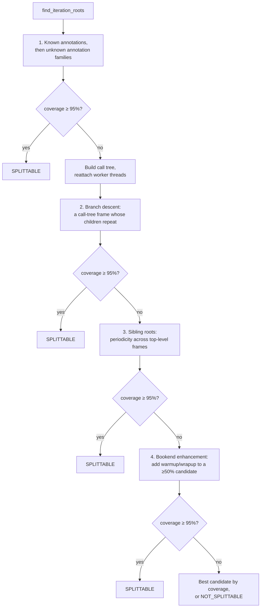

<!--
Copyright (c) 2026 Advanced Micro Devices, Inc. All rights reserved.

See LICENSE for license information.
-->


# Split traces into iterations, steady state, and phases
```{meta}
:description: Learn how TraceLens splits a large multi-iteration trace into iterations, a steady-state window, and prefill/decode phases for LLM serving, training, and diffusion workloads.
:keywords: TraceLens, trace splitting, iteration detection, steady state, phase division, prefill, decode, vLLM, SGLang, ATOM, diffusion, training, ProfilerStep, ROCm
```

This topic shows how to split a large multi-iteration trace into its repeating
unit of work — one execution step for LLM serving, one forward/backward pass for
training, one denoise step for diffusion, etc. — so you can analyze a single
representative slice instead of a whole run. Analyzing a full workload is
expensive: the trace is large, and most of it is repetition of the same handful
of iterations. Splitting it down to the meaningful components cuts the work to
analyze and yields sharper, more comparable results. Splitting works on annotated
serving traces and on generic traces from any framework, adapting to the
information each trace carries.

## Key terms

The rest of this page uses the following terms.

- **Iteration** — the repeating unit of work in the trace: one execution step for
  LLM serving, one forward/backward pass for training, or one denoise step for
  diffusion.
- **Iteration root** — the event that marks the start of one iteration and encloses
  its work. The set of iteration roots is what the splitter is looking for; the
  slices are cut at their boundaries.
- **Split (slice)** — the events belonging to a single iteration (or a selected
  window), written out as its own standalone trace.
- **Family** — a group of annotations.
- **Candidate** — one detector's proposed set of iteration roots.
- **Coverage** — the fraction of GPU-busy time that a candidate's per-iteration
  windows cover.
- **Tile** — the window covering the start of one iteration and the start of the next iteration. Tiles are contiguous so no kernels between roots are dropped.
- **Steady-state region** — the stretch of iterations at peak, saturated
  concurrency (or, for non-serving traces, most consistent duration). See
[Steady-state region](../conceptual/inference-analysis.md#steady-state-region)
- **Phase** — for LLM inference, an iteration's type: prefill vs decode vs prefilldecode

## Before you begin

Confirm you have the following before continuing.

- [TraceLens installed](../install/install.md).
- A multi-iteration PyTorch Kineto trace.

## How it works

Splitting proceeds in four stages:

```text
trace.json.gz
   └─ Detect iteration roots   detects the iteration markers i.e. where to split
      └─ Find steady state   finds the window of splits that are steady state (peak concurrency/stable runtime)
      └─ Divide phases   divides splits into prefill/decode/prefilldecode (only for LLM inference)
   └─ Extract extract   the splits. creates traces from splits
```

Detection and extraction always run. Finding the steady-state region and dividing
phases are opt-in, selected with `--find-steady-state` and `--divide-phases`, and
operate on the iterations found in the first stage.

## Split a trace

Invoke the splitter as a module, as the installed `TraceLens_split_trace`
console script, or as a direct script invocation:

```bash
# As a module
python -m TraceLens.TraceUtils.split_trace.main trace.json.gz -o ./output [OPTIONS]

# As the installed console script
TraceLens_split_trace trace.json.gz -o ./output [OPTIONS]

# As a direct script invocation
python TraceLens/TraceUtils/split_trace/main.py trace.json.gz -o ./output [OPTIONS]
```

`--store-single-iteration`, `--find-steady-state`, and `--divide-phases` can all
run in a single invocation.

| Option | Default | Description |
|--------|---------|-------------|
| `-o`, `--output-dir` | *(required)* | Output directory. |
| `-i`, `--iterations` | `all` | Iteration range to operate on: `all`, a single index such as `50`, or a range such as `10:20`. |
| `--store-single-iteration` | off | Write each iteration as its own trace file. Without it, the selected iterations are written as a single trace with the parent frames from each split root up to the process entry, but not their other children. |
| `--find-steady-state` | off | Extract a steady-state window instead of sequential iterations. |
| `--num-steps` | `32` | Number of iterations to extract for the steady-state window. |
| `--divide-phases` | off | Write every steady-state step into phase sub-folders, `prefilldecodemix/` and `decode_only/`. |
| `--llm-inference` | off | Treats the trace as LLM inference. When serving annotations are absent, batch sizes are used for phase classification and steady-state identification. |
| `--CONC`, `--OSL`, `--R` | none | Benchmark parameters. When all three are given, the ideal prefill-decode ratio is computed analytically and overrides the empirical estimate. See [Recommended profiling window](../conceptual/inference-analysis.md#recommended-profiling-window). |
| `--max-num-seq` | none | Batch-size threshold above which a shape-inferred iteration is prefill-bearing. When omitted, the threshold is inferred. |
| `--no-gap-fill` | off | Don't use tiling (explained later) |
| `--allow-degraded` | off | Return splits even when GPU coverage is below acceptable threshold. |

## Iteration-root detection

The first stage finds the *iteration roots* — the events that mark the repeating
unit. Detection is a cascade: each detector is tried in order and accepted as soon
as it produces roots whose per-iteration windows explain enough of the trace's GPU
time. Coverage is audited by correlating GPU kernels back to each root's window,
and a candidate must explain at least **95% of GPU time** to be accepted. Every
candidate is returned as a `RootSet` that carries this coverage grade.



The detectors, in order:

**Annotation-based detectors (steps 1–2).** These run first and use
annotation events in the trace. No call tree is needed.

1. **Known annotations.** Traces from patched vLLM (`execute_*`), SGLang
   (`step[*]`), ATOM, or any framework emitting `ProfilerStep#*` carry explicit
   per-iteration markers. When a recognized pattern is found, the detector also
   looks for an enclosing family to widen the split, so a 512-iteration run is not
   split into only the handful of iterations a regular expression happened to
   match. This is the fast, high-confidence path.
2. **Unknown annotation families.** When only some steps match a known pattern,
   annotations are grouped into families by name skeleton, with digit runs
   collapsed so that `execute_1_...` and `execute_2_...` share a key. The family
   that best explains the timeline becomes the iteration unit.

**Call-stack-based detectors (steps 3–5).** These run only when no annotation
detector clears the coverage gate. Before step 3, the full call tree is built
and worker-thread call stacks are spliced back onto the main thread so that
training traces — where iteration work is dispatched across threads — are
traversable as a single tree.

3. **Branch descent.** A search from the tree roots finds the first frame whose
   GPU-bearing children form a repeating pattern. Considering only GPU-bearing
   children filters out the setup and scheduling calls that obscure the iteration
   structure, and the coverage gate prevents the search from stopping on a shallow
   sub-loop that repeats but does almost no work.
4. **Sibling roots.** Some traces, especially those with sparse Python call
   stacks, have many shallow roots rather than one deep root, so the repeating pattern lives
   across roots rather than within one. Sibling-root detection finds the repeating
   period across the top-level frames.
5. **Bookend enhancement.** The repeating detectors find only the loop body, but a
   workload often does heavy one-off GPU work on either side of that loop. When a
   branch or sibling candidate already explains at least 50% of GPU time, the
   splitter wraps the parent's GPU-bearing children before the first iteration and
   after the last into two synthetic roots — a `warmup` root and a `wrapup` root —
   and keeps them if they lift the candidate over the gate. This is what makes
   diffusion traces splittable: HunyuanVideo's four denoise steps cover 58% of GPU
   time on their own, and 100% once the leading encode and trailing decode are
   captured as bookends.

If no detector clears the gate, the best candidate by coverage is returned with an
honest status so you can still use it with `--allow-degraded`; a trace that no
detector explains is reported as `NOT_SPLITTABLE`.

The detector that fires depends on what the trace contains:

| Detector | Fires when | Example workloads |
|----------|------------|-------------------|
| Known or unknown annotations | The trace has `user_annotation` events with enough GPU coverage | vLLM, SGLang, ATOM, Megatron, anything calling `profiler.step()` |
| Branch descent | There are no usable annotations, but the call tree has a frame whose children repeat | Training loops, diffusion denoise, `torch.compile` workloads |
| Sibling roots | Branch descent finds no repeating children, but the top-level frames repeat | Workloads with sparse call-stack information |

## Extraction and the split manifest

Once the roots are known, each iteration is given a *tile*. A tile is the span between one root
and the next. This captures kernels that launch just after an
iteration but before the next iteration starts.

Alongside the slices, the splitter writes a `split_manifest.json` describing the
result. Its key fields are:

| Field | Meaning |
|-------|---------|
| `status` | `0` splittable, `1` degraded (requires `--allow-degraded`), `2` not splittable. |
| `method` | The detector that produced the roots: `annotation:tier`, `family:unknown_only`, `generic:branch_descent`, or `generic:sibling_roots`. |
| `n_roots` | The number of iterations found. |
| `attribution_strategy` | How kernels were mapped to roots for the coverage audit: GPU-side annotation spans when present, otherwise CPU launch correlation IDs. |
| `coverage_selected_roots` | The fraction of GPU time explained by the tiles — the primary quality metric. |
| `gpu_event_retention` | The fraction of GPU kernels that survived extraction. This should be `1.0`, meaning every kernel is accounted for across the slices. |
| `gpu_events_duplicated` | Whether any kernel was claimed by more than one slice, which indicates a tiling error. |
| `gap_fill` | Whether tiling was used. |

A per-iteration `execution_details` file records the same accounting for each
slice.

When the detected roots do not clear the coverage gate and `--allow-degraded` is
not set, the splitter writes the manifest with `aborted` set to `true` and stops
before extraction, so you can inspect the coverage breakdown before deciding
whether to proceed.

## Steady-state identification

The steady-state region represents the most meaningful part of the workload, the definition of which changes depending on the workload. For LLM-inference, it's concurrency. Concurrency is read from the LLM inference serving annotations (`num_requests`), so without them it cannot be measured directly. For LLM inference traces that lack
annotations, the steady state region is derived from the batch sizes
which act as a proxy for concurrency. And for non-LLM workloads, concurrency is not a property at
all, so steady state is defined differently again — by the iterations whose
durations are most consistent. The method therefore adapts to the trace:

| Tier | Condition | Method |
|------|-----------|--------|
| Concurrency | Serving annotations are present | Find the region where `num_requests` is near its peak, then select a window by mode within the largest such region. Honors `--CONC`, `--OSL`, and `--R`. See
[Steady-state region](../conceptual/inference-analysis.md#steady-state-region)|
| Batch size | `--llm-inference` is passed, but there are no serving annotations | Use decode-iteration batch sizes as a concurrency proxy (in decode, batch size approximates the number of sequences), find where they are near peak, and map the region back to full iteration indices. |
| Duration | `--llm-inference` is not passed, and there are no serving annotations | Find the most duration-consistent window. |

The batch-size tier filters to decode iterations, scans for the peak, then
re-includes the prefill iterations that fall inside the region:

```text
batch_sizes:  [8, 8, 32, 32, 32, 946, 32, 32, 854, 32, 32, 32, 8, 8]
phase_labels: [D, D,  D,  D,  D,  P,   D,  D,  P,   D,  D,  D, D, D]

1. Keep decode-only batch sizes:  [_, _, 32, 32, 32, _, 32, 32, _, 32, 32, 32, _, _]
2. Peak-proximity scan (max=32):  decode steady state where decode_bs ~ 32
3. Map back to full indices:      region [2, 12) — includes the prefill spikes too
4. Select a window by mode within the region:
     mixed              representative prefill/decode ratio
     decode_only        longest contiguous decode run
     max_prefilldecode  longest contiguous prefill-bearing run
```

The duration tier picks the flattest run, skipping warmup and cooldown spikes:

```text
Durations:   3100  3050  5200  3080  3070  3090  3060  3075  3085  4900
Window 3-6:  [3080, 3070, 3090, 3060]  CV = 0.004  mean = 3075
Window 4-7:  [3070, 3090, 3060, 3075]  CV = 0.004  mean = 3074   (fastest passing)
Window 6-9:  [3060, 3075, 3085, 4900]  CV = 0.22   rejected (cooldown spike)

Result: region [4, 8) — consistent durations, with warmup (iteration 2) and
        cooldown (iteration 9) excluded.
```

## Phase division

Phase division separates LLM-inference steps into *prefill-bearing* steps, which
contain at least one prefill request — whether on its own or packed together with
decodes — and *decode-only* steps. Phase division only runs on LLM inference traces:

| Tier | Condition | Method |
|------|-----------|--------|
| Annotation | LLM serving annotations are present | Parse `context_requests` and `generation_requests` from the annotation name. A step with `context_requests > 0` is prefill-bearing; otherwise it is decode. |
| Batch size | `--llm-inference`, no serving annotations | Derive batch size per iteration from the most common first dimension of CPU op input dimensions, then split decode from prefill by batch size. |

For the batch size tier, the prefill vs. decode threshold is first derived from `--max-num-seq`. This flag specifies the maximum sequence length. Any batch size above this threshold is prefill and anything below is decode. If this flag isn't specified, then the trace splitter uses the list of batch sizes across splits to guess what the threshold is. The splitter finds the largest multiplicative gap between two batch sizes. Iterations at or below this gap are decode; those above it are prefill. Deriving batch size from CPU operation input shapes has proven the most reliable signal when annotations are absent.
Two important notes about the inferred threshold:

- The gap only counts as a real prefill/decode boundary when it is at least
  **2x** A smaller gap is treated as normal decode variation, and every iteration is labelled
  decode.
- The **two smallest batch sizes are dropped** before looking for the gap, so
  ramp-up iterations (whose batch is still filling) don't create a false boundary.

```{note}
The shape-based path has two limitations. For a pure-prefill trace there is no
decode baseline to split against, so every iteration is labelled `decode`; this is
rare in practice, since pure prefill only occurs during warmup, which steady-state
selection excludes anyway. For a fully graphed trace with no `cpu_op` shapes,
there are no input dimensions to read, so `--llm-inference` detects that every
batch size is `None` and falls through to the duration tier.
```

## Related topics

- [Inference performance analysis](../conceptual/inference-analysis.md)
- [Generate a PyTorch inference performance report](generate-perf-report-pytorch-inference.md)
- [API reference](../reference/api-reference.md)
