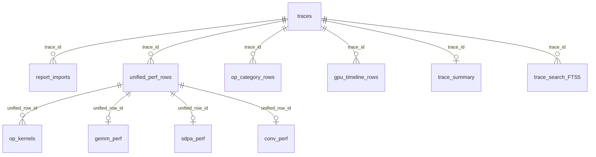

<!--
Copyright (c) 2024 - 2026 Advanced Micro Devices, Inc. All rights reserved.

See LICENSE for license information.
-->


# Index a corpus of traces in TraceLens
```{meta}
:description: Learn how to catalog profiler traces and TraceLens CSV reports into a searchable index. SQLite is the first backend; the table schema is the shared query surface.
:keywords: TraceLens, TraceIndex, corpus search, catalog schema, SQLite, unified_perf_summary, kernel summary, full-text search, performance report
```

This topic shows how to build a queryable catalog of profiler traces and
TraceLens CSV reports so you can search a corpus without reopening every raw
file. TraceIndex stores summaries and paths back to the source traces; it
doesn't replace the traces themselves.

The tables below are the catalog schema — the shared query surface. Notebooks,
SQL, and later storage backends should use these table and column names so
catalogs stay interchangeable across users. SQLite is the first backend, not a
prototype: it ships with Python, writes one file, and needs no extra service.
Other backends can implement the same schema later.

## Before you begin

- TraceLens installed (see [Install TraceLens](../install/install.md)).
- Profiler traces, and optionally existing TraceLens CSV report directories
  (for example from
  [Generate a PyTorch performance report](./generate-perf-report-pytorch.md)).

## Append a trace

Append one trace to the catalog. Pass `--report-dir` when you already have a
CSV report. This is the usual path for inference, rocprof, and pftrace
reports you generated separately:

```bash
TraceLens_trace_index --db trace_index.sqlite append \
  --trace-path /path/to/traces/rank0_trace.json.gz \
  --report-dir ./rank0_perf_report_csvs
```

If you omit `--report-dir`, TraceIndex generates a training PyTorch CSV report
and then imports it:

```bash
TraceLens_trace_index --db trace_index.sqlite append \
  --trace-path /path/to/traces/rank0_trace.json.gz
```

## Build a catalog from a list of traces

`--db` creates the SQLite file if it doesn't exist. `build` takes a list of
trace paths, generates a training PyTorch report for each, and appends it.
Pass a text file (one path per line; `#` starts a comment), repeat
`--trace-path`, and/or walk a directory with `--trace-dir`. You can combine
those flags; duplicate paths are dropped.

```bash
TraceLens_trace_index --db trace_index.sqlite build \
  --traces-file traces.txt \
  --report-root ./trace_index_reports
```

```bash
TraceLens_trace_index --db trace_index.sqlite build \
  --trace-dir /path/to/traces
```

`--trace-dir` walks the directory for trace-like files (`.json.gz`, `.json`,
`.pftrace`, `.rpd`, `.xplane.pb`). Report CSV directories such as
`perf_report_csvs` are skipped.

`--report-root` is the directory where TraceIndex writes generated training
PyTorch CSV reports when `build` or `append` doesn't pass `--report-dir`. The
default is `trace_index_reports/`.

A failed trace is recorded and the rest of the list still runs. For inference,
rocprof, or pftrace, generate the CSV reports first, then `append` each trace
with `--report-dir`.

## Search and query

Full-text search (FTS) over indexed ops, kernels, categories, and timeline
labels:

```bash
TraceLens_trace_index --backend sqlite --db trace_index.sqlite search attention
TraceLens_trace_index --backend sqlite --db trace_index.sqlite search Cijk
```

Run a single read-only SQL statement:

```bash
TraceLens_trace_index --backend sqlite --db trace_index.sqlite sqlite-sql \
  "SELECT op_category, COUNT(*) AS rows FROM unified_perf_rows GROUP BY op_category"
```

## What the catalog stores

The following tables are the catalog schema. There are ten relational tables
plus a full-text search (FTS) virtual table. SQLite holds this comfortably for
typical TraceLens corpora (hundreds of traces, hundreds of thousands of kernel
rows). The practical limit is one writer at a time, not row count.

The following diagram shows how those tables relate. Per-trace fact tables
(`report_imports`, `unified_perf_rows`, `op_category_rows`,
`gpu_timeline_rows`, `trace_summary`, and `trace_search_FTS5`) point at
`traces`. Kernel rows and GEMM / SDPA / convolution satellites point at the
`unified_perf_rows` row they came from; join `traces` through that parent when
you need the file path. Column lists are in
[TraceIndex catalog schema](../reference/trace-index-schema.md).



| Table | Contents |
|---|---|
| `traces` | One row per indexed trace |
| `report_imports` | Import history for TraceLens CSV report directories |
| `unified_perf_rows` | Rows from `unified_perf_summary.csv`. `perf_params_json` and `kernel_details_json` are parsed JSON, not the Python `repr` from the CSV |
| `op_kernels` | One row per kernel exploded from `kernel_details_summary` on a unified row, with `unified_row_id` and Tensile / layout flags |
| `gemm_perf` | GEMM shapes (`M` / `N` / `K` / batch / dtype / transpose) parsed from `perf_params` |
| `sdpa_perf` | Attention shapes (`B`, `H_Q`, `N_Q`, `N_KV`, head dim, causal) parsed from `perf_params` |
| `conv_perf` | Convolution shapes, groups, and depthwise / transposed flags parsed from `perf_params` |
| `op_category_rows` | Rows from `ops_summary_by_category.csv` |
| `gpu_timeline_rows` | Rows from `gpu_timeline.csv` |
| `trace_summary` | Per-trace summary metrics derived during import |
| `trace_search_FTS5` | Full-text search over traces, ops, kernels, categories, and timeline labels |

Query GEMM / SDPA / convolution shapes from the satellite tables, or with
`json_extract` on the parsed JSON columns. For example
`SELECT m, n, k FROM gemm_perf` or
`SELECT json_extract(perf_params_json, '$.M') FROM unified_perf_rows`.

## Example queries

Because shapes are first-class columns in the satellite tables, questions that
would otherwise mean reopening every trace become a single SQL filter. Run these
with `sqlite-sql` or the HTTP server, and `JOIN traces` to get the file to open.

### Do any traces have depthwise convolution?

```sql
SELECT t.name, c.input_channels, c.output_channels, c.groups,
       c.kernel_h, c.kernel_w, COUNT(*) AS rows
FROM conv_perf c
JOIN unified_perf_rows u ON u.id = c.unified_row_id
JOIN traces t ON t.id = u.trace_id
WHERE c.is_depthwise = 1 AND c.groups > 1
GROUP BY t.id, c.input_channels, c.output_channels, c.groups, c.kernel_h, c.kernel_w
ORDER BY rows DESC;
```

| trace | Cin | Cout | groups | Kh | Kw | rows |
|---|---:|---:|---:|---:|---:|---:|
| `diffusion_model_trace.json.gz` | 3072 | 3072 | 3072 | 5 | 5 | 2 |
| `diffusion_model_trace.json.gz` | 8192 | 8192 | 8192 | 3 | 3 | 2 |
| `diffusion_model_trace.json.gz` | 1536 | 1536 | 1536 | 5 | 5 | 1 |
| `diffusion_model_trace.json.gz` | 4096 | 4096 | 4096 | 3 | 3 | 1 |

Channels equal groups (true depthwise) at 3×3 and 5×5 with widths 1536 / 3072 /
4096 / 8192, all in a single diffusion capture. If you're looking for a
depthwise-conv workload, that's the file to open — found without reopening any
trace.

### What are the longest attention sequences in the catalog?

```sql
SELECT t.name, p.seq_q, p.seq_kv, p.heads, p.head_dim, p.dtype
FROM sdpa_perf p
JOIN unified_perf_rows u ON u.id = p.unified_row_id
JOIN traces t ON t.id = u.trace_id
ORDER BY p.seq_q DESC
LIMIT 8;
```

| trace | seq_q | seq_kv | heads | d | dtype |
|---|---:|---:|---:|---:|---|
| `video_traces_rank_5_step_3.json` | 118872 | 118809 | 3 | 128 | BF16 |
| `video_traces_rank_2_step_3.json` | 118872 | 118809 | 3 | 128 | BF16 |
| `video_traces_rank_7_step_3.json` | 118872 | 118809 | 3 | 128 | BF16 |
| `video_traces_rank_6_step_3.json` | 118872 | 118809 | 3 | 128 | BF16 |

The longest attention here is a video/DiT-style shape: sequence ≈ 119k, 3 heads,
head dim 128, BF16 — not LLM decode. Because `seq_q` / `seq_kv` / `heads` /
`head_dim` are columns, "find long-context attention" is a range query.

## Serve read-only SQL

For notebook or browser workflows, serve the SQLite catalog over HTTP:

```bash
TraceLens_trace_index --backend sqlite --db trace_index.sqlite serve --host 127.0.0.1 --port 8765
```

The server exposes:

- `GET /health`
- `GET /tables`
- `POST /query` with `{"sql": "SELECT ...", "params": [], "limit": 500}`

```{note}
Only a single `SELECT`, `WITH`, or `PRAGMA` statement is accepted. The server
is read-only but isn't authenticated, so bind it to loopback unless you put it
behind your own access control.
```

## Python API

```python
from pathlib import Path

from TraceLens.TraceIndex import append_trace, build_traces, search_index

db = Path("trace_index.sqlite")
append_trace(
    db,
    Path("rank0_trace.json.gz"),
    report_dir=Path("rank0_perf_report_csvs"),
)
build_traces(db, [Path("a.json.gz"), Path("b.json.gz")])
rows = search_index(db, "Cijk", limit=20)
```

## Related topics

- [Install TraceLens](../install/install.md)
- [Generate a PyTorch performance report](./generate-perf-report-pytorch.md)
- [Generate a PyTorch inference performance report](./generate-perf-report-pytorch-inference.md)
- [Analyze traces with the TraceLens SDK](./sdk-analysis.md)
- [TraceIndex catalog schema](../reference/trace-index-schema.md)
- [Performance report columns](../reference/perf-report-columns.md)
- [API reference](../reference/api-reference.md)
