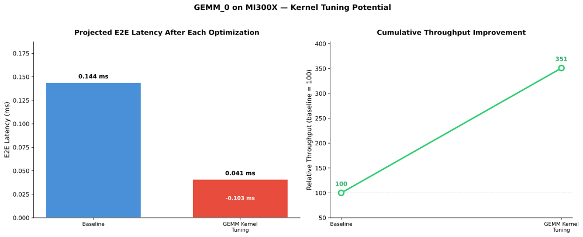

# TraceLens Standalone Analysis Report

**Trace:** `gemm_04_memory_tall_skinny.json`
**Platform:** MI300X
**Total GPU Time:** 0.144 ms
**Analysis Date:** 2026-03-09

---

## Executive Summary

This trace captures a single GEMM operation type (`aten::mm`) with a tall-skinny shape (131072×32 × 32×32) in FP16, invoked 10 times. Total GPU time is extremely short (0.144 ms), with 94% spent in computation and 6% idle. The GEMM is memory-bound (FLOPS/Byte = 16) and achieves only 23.5% of peak HBM bandwidth, indicating significant kernel optimization potential for this shape class.

---

## GPU Utilization Breakdown

| Metric | Value |
|--------|-------|
| Total Time | 0.144 ms |
| Computation | 93.75% |
| Communication | 0.0% |
| MemCpy | 0.0% |
| Idle | 6.25% |

---

## Prioritized Recommendations

### P1: Memory-Bound Tall-Skinny GEMM at 23.5% HBM Bandwidth Efficiency

| | |
|---|---|
| **Category** | GEMM |
| **Operation** | aten::mm (M=131072, N=32, K=32, FP16) |
| **Issue** | The `aten::mm` kernel with shape M=131072, N=32, K=32 achieves only 1.25 TB/s of the 5.3 TB/s peak HBM bandwidth (23.5% efficiency). The tall-skinny geometry limits data reuse and the current kernel selection appears suboptimal for this shape class. |
| **Recommendation** | Generate a replay artifact for kernel team to tune tile sizes and memory access patterns for tall-skinny geometries. Additionally, consider batching the 10 invocations via `torch.bmm` or grouped GEMM, and explore `torch.compile` for automatic batching. |
| **Estimated Savings** | ~0.103 ms (kernel tuning) + ~0.02 ms (batching) |
| **Confidence** | Medium |

**Detail:** The `aten::mm` kernel with shape M=131072, N=32, K=32 achieves only 1.25 TB/s of the 5.3 TB/s peak HBM bandwidth (23.5% efficiency). The tall-skinny geometry limits data reuse and the current kernel selection appears suboptimal for this shape class. Kernel tuning could save ~0.103 ms (closing the bandwidth gap). Batching could save an additional ~0.02 ms by amortizing launch overhead.

---

## System-Level Analysis

> **Note:** System-level analysis is exploratory. The patterns and recommendations below are under active development and may be refined as system-level analysis matures.

No system-level bottlenecks detected. GPU activity breakdown shows 94% computation, with negligible memcpy and communication overhead.

No CPU/Idle analysis was invoked (idle time 6.25% < 50% threshold, `cpu_idle_critical` = false).

No Multi-Kernel analysis was invoked (no memcpy or NCCL events detected, 0% exposed communication/memcpy).

---

## Compute Kernel Analysis

### 1. GEMM (100% of compute)

**Status:** SUCCESS

GEMMs account for 100% of compute time (0.135 ms GPU kernel time). Average efficiency: 23.51%. One unique GEMM signature with 10 invocations.

#### Operations Breakdown

| Operation | Count | Invocations | Time (ms) | % of Category | Efficiency | FLOPS/Byte | Type |
|-----------|-------|-------------|-----------|---------------|------------|------------|------|
| aten::mm | 1 | 10 | 0.135 | 100.0% | 23.51% | 16.0 | memory-bound |

#### Key Bottleneck: aten::mm (131072, 32) × (32, 32)

- **Time:** 0.135 ms (100% of GEMM compute)
- **Efficiency:** 23.51% of peak HBM bandwidth (1.25 TB/s achieved vs 5.3 TB/s peak)
- **Issue:** Memory-bound GEMM with tall-skinny shape (M=131072, N=32, K=32). Low FLOPS/Byte (16) limits reuse; achieved bandwidth is well below peak.
- **Kernel:** `Cijk_Ailk_Bljk_HHS_BH_MT64x128x32_MI16x16x16x1_SN_...` — tile size 64×128×32 appears suboptimal for this tall-skinny geometry where N=32 is smaller than the 128 tile dimension. Generate replay artifact for kernel team to investigate alternative tile configurations and memory access patterns.
- **Algorithmic:** Batch the 10 invocations together using `torch.bmm` or grouped GEMM to improve GPU parallelism and amortize memory overhead. Consider `torch.compile` to auto-batch if applicable.
- **Priority:** Critical (100% of compute time AND <30% efficiency)

#### Additional Notes

- Missing perf models: 0
- Quantized GEMMs detected: 0
- Trace is very short (total GPU kernel time ~0.135 ms); absolute impact is small, but the efficiency gap is significant for this shape class and representative of how this kernel would perform at scale.

---

## Validation Summary

| Check | Status |
|-------|--------|
| Time Sanity | PASS — Compute kernel sum (0.135 ms) vs computation time (0.135 ms) = 0% discrepancy |
| Efficiency Anomalies | PASS — No anomalies > 100% |
| Coverage | PASS — 1/1 compute categories analyzed (gemm) |
| Priority Consistency | INFO — Top compute kernel category by GPU time: gemm (0.135 ms) |

---

## Impact Summary

| Recommendation | Type | Estimated Savings (ms) | Confidence |
|---------------|------|------------------------|------------|
| Kernel tuning for tall-skinny GEMM (M=131K, N=32, K=32) | kernel_tuning | 0.103 | medium |
| Batch 10 aten::mm invocations | algorithmic | ~0.02 | low |

---

### Hardware Reference

- **Platform**: MI300X
- **Peak HBM BW**: 5.3 TB/s
- **Peak MAF (FP16)**: 654 TFLOPS
- **Peak MAF (BF16)**: 708 TFLOPS
- **Peak MAF (FP8)**: 1273 TFLOPS
- **Peak MAF (FP32)**: 163 TFLOPS
- **Memory**: 192 GB

---

*Report generated by TraceLens AgenticMode Standalone Analysis*
